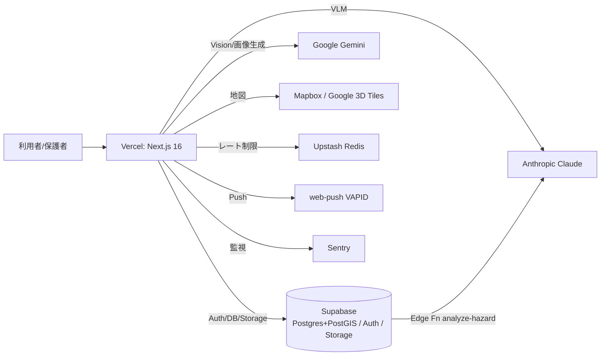
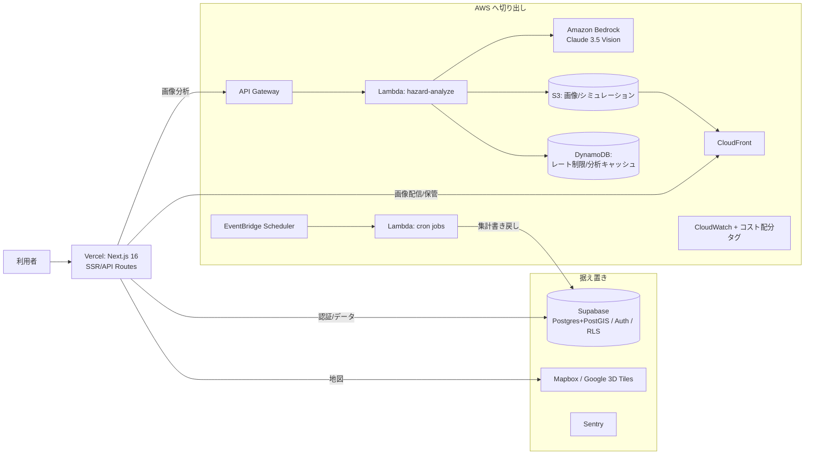
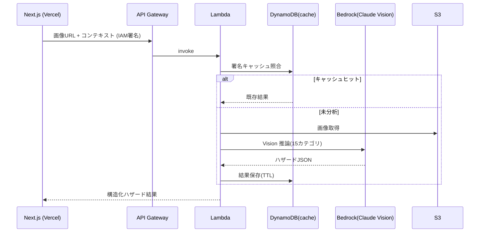
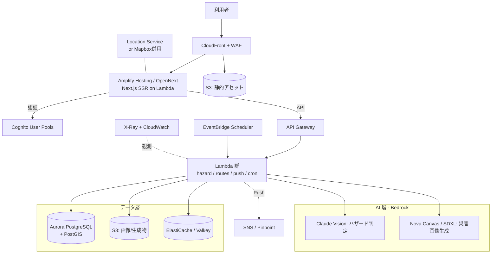
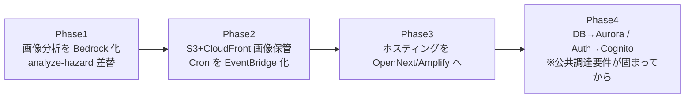

# AWS 移管アーキテクチャ提案 — pathguard-safetymap（通学路安全マップ）

最終更新: 2026-06-26 / 対象ブランチ: `claude/aws-migration-analysis-uza0an`

本書は、現行の **Vercel + Supabase + マルチAI API** 構成を AWS に移管する場合の
2つのアーキテクチャ案を示す。

- **案A「おすすめ（現実解 / ハイブリッド）」** … 移行コストとリスクを抑えつつ、機微データ（子ども・通学路）に効く部分だけ AWS に寄せる。
- **案B「理想（フルAWS / クラウドネイティブ）」** … 認証・DB・配信・AI を AWS に統合し、データ主権と統合運用を最大化する。

---

## 0. 現状アーキテクチャ（出発点）

| レイヤー | 現状サービス | 該当コード |
|---|---|---|
| ホスティング / 実行 | Vercel（Next.js 16, App Router, Serverless + Edge, Cron） | `app/`, `vercel.json` |
| DB / 認証 / ストレージ | Supabase（Postgres + PostGIS, Auth, Storage, Edge Functions/Deno, RLS） | `supabase/`, `lib/supabase-*.ts` |
| 画像分析(VLM) | Anthropic Claude（Supabase Edge `analyze-hazard`）／ Google Gemini Vision | `supabase/functions/analyze-hazard/`, `lib/gemini-hazard.ts`, `lib/vlm-analysis.ts` |
| 画像生成 | Gemini `gemini-3.1-flash-image`（浸水/津波シミュレーション） | `app/api/hazard/image/`, `lib/gemini-image.ts` |
| 地図 | Mapbox（経路/等時線/Matrix/Geocode）＋ Google 3D Tiles / Cesium / World Labs | `app/api/mapbox/*`, `app/3d-route-poc/` |
| キャッシュ / レート制限 | Upstash Redis | `lib/upstash-rate-limiter.ts` |
| 通知 | web-push（VAPID） | `lib/web-push.ts`, `app/api/push/*` |
| 監視 | Sentry | `sentry.*.config.ts` |

---

## 案A：おすすめ（現実解 / ハイブリッド）

> 方針: **「動いているもの（認証・DB・ホスティング）は触らない」。**
> AWS化の旨味が大きい “画像分析・画像保管・バッチ処理” だけを Bedrock / S3 / EventBridge に切り出す。

### 移管対象と移管先（案A）

| 機能 | 現状 | 案Aでの移管先 | 理由 |
|---|---|---|---|
| **VLM ハザード判定** | Claude / Gemini Vision | **Bedrock 上の Claude（Vision）** | 既存プロンプト資産（15カテゴリ, `vlm-analysis.ts`）をほぼ流用。IAM/VPCで通信が閉じる |
| 画像保管 | Supabase Storage | **S3 + CloudFront**（署名URL） | 画像増加時のコスト/CDNで有利。Storageと並行運用可 |
| 画像分析の実行基盤 | Supabase Edge(Deno) | **Lambda + API Gateway** | Bedrock 呼び出し・大量バッチを非同期化 |
| Cron | Vercel Cron | **EventBridge Scheduler → Lambda** | cron式そのまま移植、切り出しやすい |
| レート制限/分析キャッシュ | Upstash Redis | **DynamoDB（TTL）** or 据え置き | サーバレスでアイドル課金ほぼゼロ |
| 認証 / DB / ホスティング / 地図 | Supabase / Vercel / Mapbox | **据え置き** | 移行リスク最大・旨味最小。当面そのまま |

### 画像分析の流れ（案A）

### メリット / デメリット（案A）

**メリット**
- 移行は **画像系のみ** に閉じ、認証・DB・UIに手を入れないため**短期間・低リスク**。
- 機微データ（子どもの通学路画像）の推論が **IAM / VPC / PrivateLink** で閉域化 → 自治体・教育委員会導入時の監査に有利。
- AI APIキー（`ANTHROPIC_API_KEY` / `GEMINI_API_KEY`）の分散を **IAMロールに集約**。
- CloudWatch + コスト配分タグで**画像分析コストを正確に可視化**（現状の自前 `api-usage-logger` を補完）。
- いつでも撤退・差し戻し可能（Strangler パターン）。

**デメリット**
- AWS と Vercel/Supabase の**2系統運用**になり、認証境界（Vercel→API Gateway の IAM 署名）の設計が必要。
- 画像生成（Gemini固有）は当面残すため、AI系がマルチベンダーのまま。
- Bedrock の Claude Vision モデルが**東京リージョンで利用可能か**の事前確認が必須。

---

## 案B：理想（フルAWS / クラウドネイティブ）

> 方針: **認証・DB・配信・AI・通知・監視を AWS に統合**。
> データ主権・統合運用・スケール時コスト最適化を最大化する“あるべき姿”。

### 移管対象と移管先（案B）

| 機能 | 現状 | 案Bでの移管先 |
|---|---|---|
| ホスティング(SSR/ISR) | Vercel | **Amplify Hosting** または **OpenNext + CloudFront/Lambda** |
| API / Edge | Vercel Functions | **API Gateway + Lambda**（必要箇所のみ Lambda@Edge / CloudFront Functions） |
| 認証 | Supabase Auth | **Cognito User Pools**（JWT, ソーシャルログイン） |
| DB | Supabase Postgres+PostGIS | **Aurora PostgreSQL（PostGIS）** — RLS/RPCを再構築 |
| ストレージ | Supabase Storage | **S3 + CloudFront**（署名URL / OAC） |
| VLM 画像分析 | Claude / Gemini | **Bedrock: Claude Vision** |
| 画像生成 | Gemini flash-image | **Bedrock: Nova Canvas / Stability SDXL**（要 画質PoC） |
| キャッシュ/レート制限 | Upstash | **ElastiCache（Redis/Valkey）** |
| Cron | Vercel Cron | **EventBridge Scheduler → Lambda** |
| 通知 | web-push | **Lambda から web-push 送信**（or Pinpoint/SNS でモバイル拡張） |
| 監視 | Sentry | **CloudWatch + X-Ray**（Sentry併用も可） |
| 地図 | Mapbox / Google | **Amazon Location Service**（or Mapbox併用） |

### メリット / デメリット（案B）

**メリット**
- 認証・DB・ストレージ・AI・通知・監視が **1つの IAM / 請求 / 監査** に統合。
- **国内リージョン完結・VPC内処理**でデータ主権を最大化 → 公共調達・自治体導入で強い差別化。
- 大規模トラフィック時、Aurora 予約 / Savings Plans / Compute Savings で**コストが読める**。
- Bedrock で **Claude / Nova / Llama** をコード固定のまま切替え、品質・コスト最適化が容易。

**デメリット**
- **開発体験の大幅低下**: Vercel の `push→自動デプロイ`、Supabase の即席 Auth/RLS/Storage を失い、IaC（CDK/Terraform）と運用一式を自前で抱える。
- **Auth 移行が最大の地雷**: Supabase Auth → Cognito は UIフロー（`/login` `/register` `/reset-password`）・JWT・RLS結合・**既存ユーザーのパスワードハッシュ移行**まで波及。ほぼ作り直し。
- **PostGIS / RPC 依存**: ヒートマップ系 `SECURITY DEFINER` RPC・RLSポリシー群（`supabase/migrations/` 多数）を Aurora で再構築・再検証。
- 画像生成の**画質劣化リスク**（Gemini固有挙動の代替）。
- RDS/ElastiCache/NAT など**アイドルでも固定費**が発生し、小規模では割高。

---

## 案A / 案B 比較サマリ

| 観点 | 案A（おすすめ / ハイブリッド） | 案B（理想 / フルAWS） |
|---|---|---|
| 移行期間 | 数週間 | 数ヶ月 |
| 移行リスク | 低（画像系に限定） | 高（Auth/DB/配信を作り直し） |
| データ主権・コンプラ | 画像分析は閉域化（十分効く） | 最大（全データ国内・VPC完結） |
| 開発体験 | ほぼ維持（Vercel/Supabase継続） | 大幅低下（IaC/運用内製化） |
| 固定費 | 低（サーバレス中心） | 中〜高（RDS/ElastiCache/NAT） |
| 撤退容易性 | 高（Strangler） | 低（後戻り困難） |
| 向いている段階 | 現在〜自治体PoC | 全国展開・公共調達フェーズ |

---

## 推奨ロードマップ（案A → 案B への段階移行）

1. **Phase 1（最優先・最小リスク）**: `supabase/functions/analyze-hazard` の呼び先を **Bedrock(Claude Vision)** に差し替え。認証・DB・UIはそのまま。
2. **Phase 2**: 画像保管を **S3 + CloudFront**、Cron を **EventBridge + Lambda** に切り出し。
3. **Phase 3**: ホスティングを **OpenNext / Amplify** に移し、Vercel依存を解消。
4. **Phase 4（要件が固まってから）**: **Aurora + Cognito** へ。Auth 移行は本書最大の難所のため、自治体の閉域要件が確定してから着手。

> **結論**: いきなり案B（フルAWS）は規模に対して過剰。
> **案A を採用し、最大のインパクトである「画像分析(VLM)の Bedrock 化」から着手**するのが、
> コスト・リスク・データ主権のバランスが最も良い。案B は全国展開・公共調達フェーズの到達目標として据える。
