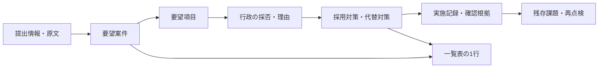

# PathGuardian 帳票・入力項目仕様

版：0.2／2026年10月10日（日本時間）  
対象：初版の学校別安全マップと通学路交通安全対策一覧表。  
根拠：[決定台帳](./decision-log.md)、[提供PDFのレビュー](./pdf-review.md)。

本文の「決定」はユーザー回答、「設計案」は未回答の具体化、「実証前確認」は実証自治体・提供者との確認を要する条件である。未回答の設計案を契約要件へ自動的に採用しない。

## 1. 必須出力と対象

| 出力ID | 帳票 | 形式・利用者 | 決定根拠 |
| --- | --- | --- | --- |
| R-001 | 学校別安全マップ | A4 PDF。行政が承認した家庭配布用の版を学校・PTAが取得して配布 | D-009・D-010・D-029・D-033 |
| R-002 | 通学路交通安全対策一覧表 | A3横PDF。行政内部用を基本に、学校・PTAは許可された内容だけ | D-012〜D-014・D-029・D-033 |
| R-003 | 対策一覧データ | CSV。現在の閲覧権限と出力目的の範囲内。家庭配布用には使わない設計案 | D-025・D-033 |

別様式の改善要望書・対策報告書、画像だけの地図出力、公開Webマップ、任意の自治体帳票を編集する機能は初版必須にしない。参考PDFの項目を採用することと、すべての自治体独自様式へ対応することを区別する。

## 2. 対策一覧表の項目と入力

| 表の項目 | 保持する内容・入力元 | ルール・未決点 |
| --- | --- | --- |
| 学校名 | 正式学校名、学校ID、提出元学校、関連学校 | 1行＝1要望案件。複数校が関係する場合の表示はQ-017-Hで確認 |
| 要望年度 | 最初の要望年度。西暦の年度値と表示名 | R6＝2024年度として保持。年度の範囲は日本時間4月1日〜翌3月31日を設計案とし、自治体規程へ照合 |
| 箇所No. | 元資料番号、行政の案件番号、内部ID | PDFでは行政が確定した表示番号を使う案。取込時は元資料番号を消さない。番号体系はQ-017-H |
| 危険箇所（所在地） | 公共道路等の所在地、区間の起終点説明 | 公共の危険位置として扱う。家庭の住所を業務項目として収集しない |
| 危険箇所（場所説明） | 目印、交差点、道路名、区間・進行方向等 | 所在地だけで位置を断定しない。地図の地点・区間と照合 |
| 危険箇所の状況 | 元の提出内容と、行政が確認した観察内容 | 保存方針の範囲で原文・履歴を保持し、掲載要約を別に編集。撤回・削除はD-024に従う。確認日・確認水準も参照 |
| 対策の要望内容 | 提出者の希望。複数要望を保持 | 行政の採用判断と分離。不採用でも元の要望を消さない |
| 対策方法 | 行政の回答概要、採用する対策、代替対策、実施不可理由 | 対策の採否と実施状態を別に持つ。長文は改ページして全文を載せる |
| 担当部署・道路管理者（国） | 国に該当する対応機関の担当フラグ | 担当欄の○は担当あり。対策完了・受諾・自動送信を示さない |
| 担当部署・道路管理者（県） | 都道府県に該当する対応機関の担当フラグ | 提供PDFには県列がある。市列へまとめない |
| 担当部署・道路管理者（市） | 自治体に該当する対応機関の担当フラグ | 道路管理者は学区や住所だけから自動確定しない |
| 担当部署・警察（交通課） | 警察の担当フラグ、案件詳細に具体名 | 初版の外部機関の回答は職員が根拠付きで記録（D-038） |
| 担当部署・教委 | 教育委員会の担当フラグ | 学校が提出したことだけで教委担当にしない |
| 対策結果 | 対策ごとの状態と、表示用の○・△・× | D-014。混在時は対策名と記号を併記。集約記号1つへ置換しない |
| 備考 | 残存課題、次回確認、説明用補足 | 内部メモとは別項目。学校・PTA向けに出してよいかを確認 |

具体的な部署名・担当者・連絡履歴・受諾状態・判断根拠・実施日・次回確認日・優先度・監査履歴は案件詳細にも保存する。担当列が埋まっているだけでは、案件責任者の登録を代替できない。

資料の空欄をシステムに取り込む場合、「未入力／未確認」と「担当なし」を区別する設計案。確認済みの担当なしを示す記号と、未確認時の表記はQ-017-Hで確定する。

## 3. 要望・対策・結果の分離

### 3.1 論理関係

1要望案件に複数対策を持ち、表の1行で結果を併記することは決定済み。要望項目・判断を独立したテーブルにするか、版を持つ子レコードにするかは物理設計で決める。複数地点を1案件に関連付けるかはQ-033の回答に従う。

### 3.2 内部状態と帳票記号の設計案

| 対策の内部状態候補 | 表示案 | 条件 |
| --- | --- | --- |
| 未判定・対策未登録 | 未判定 | 対策済み・実施不可へ自動分類しない |
| 検討中・予定・対応中 | 対策名＋△、詳細状態を併記 | △へまとめる対象はQ-034で確認。保留は理由・再確認日も示す |
| 実施完了 | 対策名＋○ | 実施内容・日・確認者・根拠を記録した対策に限る |
| 実施不可 | 要望項目／対策名＋× | 判断者・判断日・不可理由を持つ。理由の共有可否は別判定 |
| 取り下げ | 取り下げと明記 | 実施不可の×へ置換しない |

複数対策で1つでも未完了なら、案件全体を無条件に「対策完了」にしない。全項目が実施不可でも「危険解消」「安全」とは表示しない。案件を保留・経過観察・終結へ進める条件はQ-034で確認する。

### 3.3 旧資料の取込

原資料の行番号、学校名、要望年度、箇所No.、原文、担当欄、単一の結果記号、出典ページ・資料版を保持する。旧資料から転記した「元資料の結果」と、新製品で確認した「対策別の結果」を分ける。

原票が○でも、実施日や対策ごとの根拠が不明なら、アプリが実施済み根拠を捏造しない。×でも代替対応が記載されていれば、人が要望・回答・対策へ分ける。単一記号をすべての子対策へコピーする変換は行わない。

初版のCSV取込採否はQ-017-Gで確認中。採用する場合は標準CSV、項目対応、反映前プレビュー、エラー行、再取込時の照合を設ける。PDF自動登録・OCRは初版必須にしない。

## 4. レイアウト・生成・配布

### 4.1 学校別安全マップ

設計案：学校名、対象年度、確認済み共通通学路、危険地点・区間、地点番号、注意点と安全行動、確認日、作成日、承認者の役割、版番号、出典・利用上の注意を載せる。写真は加工・確認済みで配布対象に許可されたものだけを選ぶ。行政内部の優先度、担当者個人連絡先、原投稿者情報、内部メモを掲載しない。

危険が残る箇所、対策済み箇所を混同しない。マップ上の「対策済」は特定の対策の実施状況を表し、通学路全体の安全保証にはしない。注意点は職員が編集できる定型文を基本案とし、生成AIを必須にしない。

共通通学路の線と個々の家庭の経路を分離する。通学路の出典・確認日・確認者・対象期間を保持し、現在の学校指定か不明な線を確認済みとして配布しない。

### 4.2 対策一覧表

設計案：元資料に近い多段見出しを持つA3横。学校名、要望年度、箇所No.、危険箇所2欄、状況、要望、対策方法、国・県・市・警察・教委、対策別結果、備考を並べる。タイトル、対象年度、対象校、基準日時、作成日、版、ページ番号、凡例を付ける。緑の見出し色は見本に合わせる提案であり、配色の採用は未確定。

全ページで見出しと記号の凡例を繰り返す。長文で1行が1ページに収まらない場合は、案件番号・学校名と「続き」を表示して継続する。読みづらくなるまで文字を縮小したり、要望・理由を無説明に省略しない。白黒印刷でも罫線・記号・状態名で理解できることを確認する。

参考PDFの左端数字は、正式コードかが未確認なので、新帳票の一意な番号として採用しない。元の数字は資料記録に残す。

### 4.3 CSV

設計案：表示対象の条件と権限をPDFと一致させる。一覧表の項目に加え、案件ID、元資料番号、最初の要望年度、表示対象年度、版、対策ごとの名称と結果、確認日時を識別できる形にする。固定の列名・文字コード・複数対策の表現はQ-017-H／物理設計で確定する。

CSVは標準ではUTF-8 BOM付きの候補。Excel等で式として解釈される先頭文字を含む自由記述の出力対策を定義し、改行・区切り・引用符を適切に扱う。文字コードや表計算ソフトへの適合はT-002・T-008で実物確認する。

### 4.4 承認と停止

1. 生成申請時に利用者・所属・対象学校・目的・取得権限を確認する。
2. 地点・案件・対策・本文・写真・通学路・学区・背景地図・テンプレートの版と出力条件を固定する。
3. 家庭配布版は行政の指定承認者が内容を確認し、特定版を承認する。内部版を家庭配布版へ権限だけで流用しない。
4. ジョブ実行時・配布可否確定時・ダウンロード時にも権限と停止状態を確認する。申請後の所属解除や内容変更を見逃さない。
5. 家庭配布内容に関係する対応状況・注意内容・位置・写真・通学路等が変わったら、関連旧版の新規取得・配布を止め、修正版を再承認する（D-039）。内部メモのみの変更を停止対象に含めるかは、掲載項目への依存から判定する設計案。
6. 個人情報混入や誤記の申告でも停止・訂正を行える。配布済み資料は学校へ対象版・訂正内容を案内し、訂正対応を記録する。

設計案として、学校・PTAが既存の配布手段で家庭へ渡し、家庭のメールアドレスや配布先名簿を行政用へ取り込む機能は設けない。具体的な配布者・取得者・訂正案内の完了記録はQ-015で確認する。ダウンロード済みのPDF・紙を技術的に消去・回収できるとは約束しない。

## 5. 地図の利用条件と実証前確認

背景地図の候補は既存技術のMapboxだが、採用確定とはしない。公式資料は静的地図の出典表示に加え、日本地図の印刷用途の制限を説明している。行政向け有償サービスによる学校・家庭へのPDF配布が、採用データと契約で認められるかをT-003で確認する。[Mapboxの出典・印刷案内](https://docs.mapbox.com/help/ja/dive-deeper/attribution/)

地図画像の生成API自体がPDFを生成するわけではない。画像取得・独自レイヤー描画・文書生成・承認を分け、解像度、文字、線の太さ、余白、出典をA4実印刷で検証する。[静的地図の公式資料](https://docs.mapbox.com/help/dive-deeper/static-maps/)

確認が取れない背景地図を、既存アプリで表示できるという理由だけで家庭配布に使用しない。利用条件を満たす地図にする選択と費用は、T-003・T-008の結果を記録して決める。

## 6. 受入確認

| 確認 | 合格条件 |
| --- | --- |
| 項目照合 | PDFとCSVに必須項目があり、国・県・市、住所・場所説明を欠落させない |
| 1案件・複数対策 | 1行を保ち、○・△・×の混在と各対策名を確認できる |
| 原資料の移行 | 単一記号を勝手に対策へ展開せず、未確認・空欄・原番号を保持 |
| 年度またぎ | 同じ案件を継続し、要望年度・表示年度・年度末版・現在状態を区別 |
| 家庭配布 | 行政承認済みの版だけを取得でき、内部メモ・職員個人情報を含まない |
| 権限変更 | 生成待ち、実行中、生成済みの各段階で所属解除・停止を反映 |
| 内容変更 | 関連旧版を新規取得・配布できず、再承認後に修正版を取得できる |
| 印刷 | A4地図・A3横一覧をカラーと白黒で実印刷し、判読・改ページ・地点番号を確認 |
| 生成失敗 | 地図取得や画像処理が失敗した出力を、完成した安全マップと表示しない |
| 旧版の訂正 | 対象版・訂正内容・学校への案内・対応履歴を追える |

この表は開発後の検証仕様であり、アプリで合格済みという意味ではない。未決の表記・番号・状態はQ-017-H・Q-034で決定してから受入ケースを固定する。
