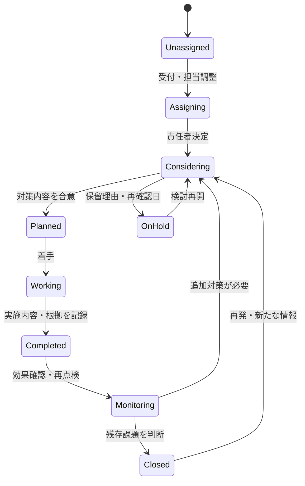
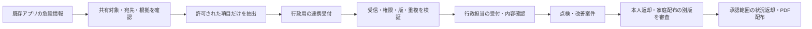
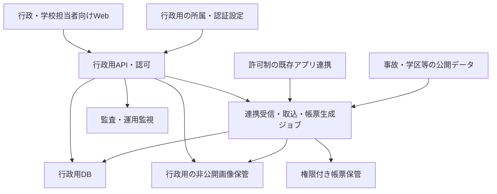

# PathGuardian 行政用アプリ 要件・設計仕様書

版：0.2／回答・実物帳票を反映した草案  
作成・更新日：2026年10月10日（日本時間）  
仮称：PathGuardian 行政用。正式名称・ドメイン・契約主体は未決。  
対象：既存アプリとは別に作る行政用製品の初版と、将来機能との接続。

## 1. 仕様の位置づけと確定方針

本書は、共有された構想を業務・機能・データ・受入条件へ具体化した草案である。「決定」以外の細部は設計提案として扱う。初版開発の見積りや契約に使う前に、[質問・タスク台帳](./questions-and-tasks.md)の未決項目を処理する。

初回のD-001〜D-005に続き、対象規模・業務・帳票・連携・権限等の回答を[決定台帳](./decision-log.md)へ集約した。本書はその回答と[提供PDFのレビュー](./pdf-review.md)を反映する。具体的な帳票の項目・記号・配布は[帳票仕様](./report-specification.md)を参照する。設計案と実証先への確認事項は、決定とは区別する。

| ID | 確定した方針 |
| --- | --- |
| D-001 | 行政用は、現在のPathGuardianアプリとは別の製品にする |
| D-002 | 行政用のデータ・権限を分離し、許可された危険情報だけを連携する |
| D-003 | 初版は受付、現地確認、担当割当、改善進捗管理、地図・報告書の出力を完成目標とする |
| D-004 | 実証の協力先は現在まだ決まっていない |
| D-005 | 行政職員と、招待された学校・PTA担当者が行政用にログインする。一般保護者は既存アプリから許可した危険情報を共有する |

柏市、特定小学校、90日間、料金、期限、AI性能、道路対策の実施は、確定事項ではない。

## 2. 目的・成功の定義

### 2.1 製品の目的

行政と学校・PTAが、危険情報を受け付けて確認し、担当機関を調整し、対策の進捗と結果を追跡し、学校別の安全地図・説明資料を更新できるようにする。

既存アプリは家庭・地域・安全教育の接点を担う。行政用は、受理した情報を行政業務の案件として扱うための接点を担う。利用許可だけで行政が危険を確認したことにはならず、アプリへの登録だけで工事や公的な対応が約束されたことにもならない。

### 2.2 初版で完了させる一連の業務

1. 学校・PTA担当者または職員が危険情報を登録する。既存アプリからの連携情報も受付候補に入る。
2. 受付担当が対象地域、内容、位置、写真の共有可能性、重複を確認する。
3. 必要に応じて現地確認を行い、確認結果を記録する。
4. 案件責任者と対応機関を決め、対策の検討・依頼・進捗を記録する。
5. 対策内容、実施日、根拠、残存課題を記録する。
6. 閲覧対象に合わせた地図・一覧・報告書を作成し、担当者が内容を確認する。
7. 再点検日を設定し、翌年度へ情報を引き継ぐ。

### 2.3 成功条件と測定

D-037により、成功条件は業務一巡の確認と作業時間の比較測定とする。30%削減は確定目標にしない。協力先で現行作業の基準を測った後、削減率・参加人数・具体的合格基準をT-009で決める。

| 指標 | 測定方法 | 初期の目標案・注意 |
| --- | --- | --- |
| 地図・一覧表作成時間 | 同じ地点数・資料内容で現行作業と比較。確認・修正・承認も含む | 比較測定は必須。削減率の数値目標は事前計測後に合意 |
| 受付・担当調整の負担 | 受付から担当確定までの時間、手戻り、作業時間を測る | 現行基準をT-001で取得してから目標を決める |
| 案件の追跡可能性 | 有効案件に責任者、進捗、次の確認日、履歴があるか | 初版の有効案件で記録漏れゼロを受入候補にする |
| 出力の正確性 | 地点番号、地図、一覧、本文、公開範囲を照合 | 別案件の写真混入・非公開情報の混入ゼロ |
| 利用者の自力完了 | 職員・学校担当者が代表シナリオを操作 | 測定人数と合格基準はQ-023で決める |
| 対策の効果 | 対策前後の行動指標、再点検結果、残存課題 | 初版では記録を可能にする。短期実証だけで事故減少を証明しない |

## 3. 全体構想との関係と初版の範囲

### 3.1 4製品領域の配置

| 元構想の領域 | 行政用で扱う内容 | 既存アプリ・将来機能との関係 |
| --- | --- | --- |
| Safety Intelligence | 事故履歴、学校区別の集計。AI点検優先度は将来 | 公開データや許可済み分析結果を行政用へ取り込む |
| Safety Management | 受付、現地確認、案件、対策、地図・帳票。初版の中心 | 許可済み危険情報を既存アプリから受け付ける |
| Safety Guardian | 初版では家庭のGPS・個人ルートを扱わない | 元の投稿者に本人向け承認済みの受付・対応状況を返す（D-020） |
| Safety Quest | 初版では児童のゲームを作らない | 改善情報の教材反映等は、公開範囲を限定した将来連携 |

製品の分離を前提に、共通の用語・データ形式で接続する。内部テーブルを両アプリから直接読み書きする設計は採用しない。

### 3.2 初版の機能範囲

対象は1自治体の一部学校（D-006）、交通・道路周辺の危険（D-007）。学校区外や隣接市の道路も、関連学校が利用する場合は管轄を確認する。対象自治体数と全国の事故データ利用を混同しない。実際の自治体・学校・件数はT-010で確認する。

| 区分 | 内容 |
| --- | --- |
| 初版の中心 | 組織・招待・全員MFA・学校／PTA別権限、学校・学区・確認済み共通通学路、対象地域の事故履歴、加工写真付き提出、行政への集中受付、点検記録の行政確認、担当・優先度・次回確認日・複数対策・年度継続、検索・一覧、履歴・監査 |
| 初版で採用する出力・連携 | 家庭用A4安全マップ、行政用A3横対策一覧表PDF・CSV、行政による家庭配布承認、旧版停止・再承認、投稿ごとの許可とAPI連携、本人向け承認済み状況の返却、アプリ内・メール通知 |
| 初版採否または詳細を確認 | CSV取込の採否、複数地点案件、番号・空欄表記・状態の具体化、画像形式・容量、認証復旧、ジョブ・メール基盤、正式提出・保存・責任・性能・費用・納期 |
| 初版必須にしない | 行政用スマートフォン操作、一般公開Webマップ、面の危険区域編集、外部機関専用アカウント、個別学校契約、独自帳票編集、別様式の改善要望書・対策報告書、OCR自動登録。SSO・複雑な承認は自治体条件を確認して再判断 |
| 将来機能 | 全国AI危険予測、類似道路検索、写真分析、生成AI文案、設置物・QR、音声Bot、モンスター教材・イベント |

初版はデモ確認の後に実証用へ進む（D-032）。デモで扱う情報は説明用データとし、実証用初版のMFA・連携・保存・復旧等の完成をデモの画面確認だけで済ませない。採否と詳細の未決点は台帳へ残す。既存アプリの既存機能を削除・停止する決定は含まない。

### 3.3 初版の対象外とする提案

児童の個別アカウント、個人の常時位置追跡、自宅住所からの通学ルート管理、保護者からの無制限な行政用への直接投稿、緊急通報の代行、事故を防ぐ保証、写真だけによる建物・塀の健全性認定、AIによる対策の自動決裁、道路工事の発注・支払、児童の経済的トークン報酬。

防犯・不審者情報と防災情報の専用管理は初版対象外。倒木や側溝の水たまり等は道路周辺の危険として扱えるが、防災監視・避難判断へ対象を拡大したことにはしない。危険な塀の報告は受け付けても、写真だけで構造的安全性を認定しない。

## 4. 利用者・組織・権限

### 4.1 組織構造

自治体を契約・データ管理の単位とし、招待された学校・PTAの利用をその契約に含める（D-036）。教育委員会、道路関連部署、学校、PTA等を配下組織として扱う設計案。行政の受付窓口は自治体ごとに設定し、提出と許可制連携を集約する（D-008）。1人が複数組織へ所属する場合は、操作中の所属と権限を明示する。

県・国・警察・私有地管理者等の外部機関の専用アカウントは初版に含めない（D-038）。職員が実際の連絡・回答を記録し、宛先・日付・方法・回答元・根拠を持つ設計案。担当欄のチェックと、依頼送信・受領・受諾を分ける。入力しただけで相手に連絡が届いたと表示しない。

学校区と道路管理の管轄は別の属性である。学区に入っていることだけで、その自治体が当該道路の管理者だと判定しない。Q-008・Q-009で具体的な組織・担当範囲と管轄判断を詰める。

### 4.2 権限表の提案

表の「担当範囲」は、所属・学校・案件担当・個別共有を組み合わせて決める。単にログインしているだけで全学校・全部署の内部情報を閲覧できない。

| 操作 | 学校担当 | PTA担当 | 受付／案件担当職員 | 自治体管理者 | 配布・返却承認者 | サービス運営者 |
| --- | --- | --- | --- | --- | --- | --- |
| 行政用ログイン | 個別ID＋MFA | 個別ID＋MFA | 個別ID＋MFA | 個別ID＋MFA | 個別ID＋MFA | 運用専用・要設計 |
| 危険情報提出・補足 | 自校分 | 自分の提出・許可範囲 | 担当範囲 | 付与権限内 | 付与権限内 | 原則なし |
| 案件閲覧 | 自校向け共有内容 | 自分の提出と明示共有案件 | 担当範囲 | 明示された自治体内範囲 | 承認対象の必要範囲 | 原則なし |
| 点検記録提出 | 可。行政確認待ち | 可。行政確認待ち | 可 | 付与権限内 | 付与権限内 | なし |
| 受付判断・点検採用・重複整理 | 補足・提案 | 補足・提案 | 個別付与した範囲 | 同権限を付与した場合 | 同権限を付与した場合 | なし |
| 担当・優先度・案件進捗更新 | 原則提案のみ | 原則提案のみ | 担当・委任範囲 | 同権限を付与した場合 | 同権限を付与した場合 | なし |
| 学校が担う対策の実施報告 | 提出可。確定権限は要確認 | 許可された担当対策の報告 | 確認・確定 | 付与権限内 | 付与権限内 | なし |
| 家庭配布の承認 | 確認・修正依頼 | 許可版の確認・修正依頼 | 申請 | 承認権限を別途付与した場合 | 行政の指定承認者 | なし |
| 元投稿者向け返却承認 | なし | なし | 申請・機械的状況は要設計 | 承認権限を付与した場合 | 承認方法はQ-028 | なし |
| PDF／CSV取得 | 自校・許可用途 | 明示許可の範囲 | 担当範囲 | 付与範囲 | 付与範囲 | 原則なし |
| 招待・権限付与 | 初版では原則なしの案 | 原則なし | 原則なし | 指名管理者 | 管理者権限を付与した場合 | 契約・運用設定の範囲 |

一般保護者は行政用にログインせず、既存アプリで投稿ごとに共有を許可し、本人向けに承認された状況を確認する。各ロールの兼務は可能な設計案だが、管理者だから配布承認できるとは自動判定しない。担当範囲・招待権限・兼務と確定操作の詳細はQ-009・Q-010・Q-021・Q-028。

職務と家庭配布・本人返却承認の権限は分離する設計案。運営者の障害調査アクセスは、期間・目的を限定して記録する案。詳細はQ-010・Q-015・Q-021・Q-028で決める。

### 4.3 アカウント管理

- 招待は所属の確認を経て発行し、有効期限・一回限りの利用・取り消しを持つ。
- PTAの年度交代、教員の異動、退職で所属を解除できる。過去の作成者記録は保持要件に従う。
- 組織共用IDより個別担当者IDを基本案とし、担当変更と操作履歴を追えるようにする。
- 実証用初版は行政・学校・PTA全員にMFAを必須とする（D-035）。登録・確認・端末紛失時の復旧・所属解除を扱う。SSO、認証器の種類、セッション期限、復旧担当、端末・ネットワークの実条件はQ-010・Q-022で確定する。

## 5. 用語・データの分離

| 用語 | 定義 |
| --- | --- |
| 提出情報（Observation） | ある人・資料・連携元が報告した内容。報告内容は確認済み事実とは限らない |
| 危険地点・区間（HazardSite） | 地図上の問題の位置・範囲。複数の提出情報・学校と結び付く |
| 点検記録（Inspection） | 誰が、いつ、何を、どの方法で確認したかの記録 |
| 改善案件（Case） | 対応責任者、対象地点、進捗、期限、判断を管理する業務単位 |
| 対策（Measure） | 除草、修繕、道路整備、注意喚起、教育等の具体的な対応。1案件に複数持てる |
| 効果確認（Evaluation） | 対策後の状況・行動指標・残存課題を確認する記録 |
| 共有許可（SharingAuthorization） | 元情報を行政へ渡せる根拠・対象・期間・内容の記録 |
| 承認済み共有版（ApprovedView） | 家庭配布・本人返却等の用途別に、共有してよい項目を選び、承認した別の版 |
| 点検優先度 | 点検する順番を考えるための補助指標。事故確率・安全保証ではない |
| 学区版（DistrictVersion） | 出典・年度・境界・確認者を持つ学校区の特定バージョン |
| 共通通学路版（SchoolRouteVersion） | 学校・行政が確認した共通経路。情報源・確認日・対象期間を持ち、家庭ごとの経路と分離 |
| 対応優先度 | 行政が理由付きで設定する高・中・低。将来AIの点検優先度と別項目 |
| 要望年度／表示年度 | 最初に要望した年度と、継続案件を掲載する年度。事故の暦年・資料作成日とも別 |

同じ交差点に見通しと路面の問題がある場合、地点を共有しつつ別の提出・案件・対策を持てる。単一ステータスで全問題をまとめて完了にしない。

## 6. 状態と業務フロー

### 6.1 状態を分けて持つ

| 対象 | 状態案 | 運用上の意味 |
| --- | --- | --- |
| 提出の受付 | 下書き／提出済み／補足待ち／受付済み／重複整理／対象外／撤回 | 原提出の受信・受付判断。現地点検とは別 |
| 内容・点検の確認 | 未確認／確認中／点検記録確認待ち／行政確認済み／確認できず／訂正必要 | 提出者と行政の確認を分け、方法・日付・未確認部分を記録する案 |
| 案件進捗 | 未割当／担当調整中／対策検討中／対応予定／対応中／対策完了／経過観察／保留／終結 | 対応する業務の進み方 |
| 配布・返却審査 | 下書き／承認申請中／差戻し／承認済み／停止／改訂待ち | 家庭配布版と本人返却版を別に審査。一般公開Webの公開状態は将来 |
| 対策進捗 | 未判定／検討中／予定／対応中／実施完了／実施不可／保留／取り下げ | 複数の対策それぞれの状態。帳票記号との対応はQ-034 |
| 効果確認 | 未評価／評価予定／評価済み／再点検必要 | 対策完了後の確認 |
| 連携許可 | 未許可／有効／期限切れ／撤回 | 行政への共有が許されているか |

「新規投稿」と「点検確認待ち」を分ける。行政・学校・PTAの点検記録は提出でき、行政が確認して判断に採用する（D-015）。受付済みでも未点検、点検済みでも補足待ちの組合せを表現する。「改善要望済み」は提出先・提出日・受領の有無を伴う履歴とし、対応機関の着手状態とは別にする。システム受付と自治体の正式受理の関係はQ-013で確認する。

### 6.2 案件の代表遷移

表示名は前項の日本語を用いる。これは代表経路であり、保留・実施不可・代替対策・一部完了等の全遷移を確定した図ではない。外部機関の小規模な即時修繕等で途中の状態を省略する場合は、権限者が理由と実施記録を残す。状態・終結条件はQ-034で詰める。

### 6.3 更新条件・例外

| 操作 | 必要な情報・制約 |
| --- | --- |
| 受付済みにする | 受付者、地域・内容の確認、位置確度、共有範囲。未確定事項を残せる |
| 点検記録を行政確認済みにする | 点検者・日・方法・結果・未確認部分に加え、行政確認者・確認日・採用範囲。写真だけでは代替しない |
| 担当を割り当てる | 案件責任者、対応機関、次の確認日。機関の受諾状況は別に記録 |
| 対策を実施完了にする | 対策内容、実施日、実施者／確認者、根拠、残存課題。写真は必要性に応じる。要望の不採用理由と分離 |
| 案件を対策完了にする | 複数対策の実施状態と未解決項目を確認。1対策の完了だけで全体を完了にしない。集約条件はQ-034 |
| 保留にする | 理由、責任者、再確認日。無期限に見えなくなる設計にしない |
| 終結にする | 終結理由、判断者。安全保証として表示しない |
| 重複とする・結合する | 統合先、理由、原提出への参照。後から結合を訂正できる |
| 対象外・管轄外とする | 判断理由、案内先の有無。実際に送っていなければ転送済みと表示しない |
| 再開する | 再発内容、根拠、理由。過去の完了記録を消さない |
| 複数人が同時更新 | 更新版番号を照合。不一致は再読み込みを促し、上書きしない |

案件ごとに責任者と次回確認日を設定し、期限超過を可視化する（D-017）。行政が高・中・低の優先度と判断理由を記録する（D-016）。優先度は対応順の判断補助であり、事故確率や警察等の即時出動を意味しない。受付窓口の担当者は案件責任者決定までの滞留を管理する案。対応時間やSLAはQ-014・Q-021で確認する。

### 6.4 年度継続と資料版

未完了の案件は同じ案件として翌年度へ継続し、最初の要望年度、担当変更、対策、過年度の判断履歴を維持する（D-027）。年度末の状態を固定し、翌年度の一覧には継続案件として載せる。案件の複製で同じ対策を二重計上しない。

要望年度、一覧表の表示年度、事故の暦年、学区・通学路の有効期間、点検日時、帳票基準日時を別項目とする。年度は4月1日〜翌3月31日を設計案とし、対象自治体の規程に照合する。年度切替後も過去の帳票・配布版の内容を変更しない。

## 7. 機能要件と受入条件

以下は回答を反映した要件と設計案。F-001〜F-004・F-006〜F-016・F-018〜F-020を初版設計の中心とする。F-005のCSV取込採否とF-017の効果確認の細かさは未決として台帳に残す。ACは開発後に確認する受入条件であり、合格済みを示さない。

| 要件ID | 機能 | 仕様案 | 受入条件 |
| --- | --- | --- | --- |
| F-001 | 組織・学校・招待 | 自治体等、部署、学校、PTA、担当者を管理。学校／PTAの権限を分け、全員MFA | AC-001：MFA未完了・所属解除後は画面・API・画像・出力で旧権限を使えない |
| F-002 | 学区地図 | 学区の版、出典、確認状況を表示。境界候補と確定した関連学校を区別 | AC-002：境界付近・複数学区・未整備を一律に1校へ確定しない |
| F-003 | 事故履歴 | 対象自治体と周辺地域の対象年・票種・条件を明示。元の事故位置と危険地点は別レイヤー | AC-003：本票／補充票を混ぜて事故数を水増しせず、欠損位置を一覧で追える |
| F-004 | 提出・写真 | 位置、分類、説明、確認日または撮影日、提出者所属、写真を登録。位置は手動指定可 | AC-004：現在地権限なし・写真なしでも提出可。添付失敗時の保存状態を説明 |
| F-005 | 既存資料取込 | CSV等の項目対応とプレビューを行い、元資料・行番号・取込履歴を持つ | AC-005：再取込で重複増殖せず、不正行と反映件数を確認できる |
| F-006 | 許可制連携 | 投稿ごとの本人許可でAPI連携。再送・更新・撤回と本人向け状況返却を追跡 | AC-006：未許可・期限切れ・別自治体向け・禁止項目を受け入れず、内部情報を本人へ返さない |
| F-007 | 受付確認 | 補足依頼、受付、対象外、確認済み、位置修正を記録 | AC-007：受付・配布承認・現地確認を別々に判定できる |
| F-008 | 重複整理 | 距離、分類、時期、説明等で候補提示。人が結合する | AC-008：近接する別危険を自動で同一案件にしない。原文の出典が残る |
| F-009 | 現地確認 | 行政・学校・PTAの点検者、日時、方法、観察、未確認事項を保存し、行政が確認・採用 | AC-009：点検提出と行政確認を分け、無権限・写真AIの推測だけで確認済みにしない |
| F-010 | 担当・管轄 | 責任者、道路管理者候補、対応機関、受諾、担当変更を管理 | AC-010：管轄が未確定でも保留理由と次の行動を記録できる |
| F-011 | 改善管理 | 案件・複数対策の進捗、不可理由、代替対策、次回確認日、実施根拠、完了・再開履歴 | AC-011：一部完了と全体完了を混同せず、無権限・同時更新による変更損失を防ぐ |
| F-012 | 検索・一覧 | 学校、分類、受付・確認・案件状態、担当、優先度、要望年度、表示年度、期限超過 | AC-012：一覧と地図に同じ条件を適用し、除外・未取得を説明できる |
| F-013 | 地図・帳票 | 閲覧対象と対象時点を選び、番号・写真・説明・履歴から出力 | AC-013：非公開本文・個人情報が別対象向けのPDF・画像・CSVへ混入しない |
| F-014 | 配布・返却審査 | 家庭配布・本人返却の内容を別に審査し、版を承認。配布に関係する変更で旧版停止 | AC-014：承認のない家庭配布と停止旧版の取得を拒否し、修正版は再承認を要する |
| F-015 | 通知・未処理 | 担当割当、補足依頼、確認期限超過、審査待ちをアプリ内・メールで通知 | AC-015：未送信・配信失敗を送信済みと扱わず、メールに内部資料・写真を含めない |
| F-016 | 年度更新 | 過年度の記録を参照し、再点検対象・資料版を引き継ぐ | AC-016：年度切替で前年度の地図・進捗・学区版が書き換わらない |
| F-017 | 効果確認 | 対策ごとの観察、指標、測定条件、再確認、残存課題を記録 | AC-017：対策完了だけで効果ありと自動判定しない |
| F-018 | 監査・訂正・終了 | 変更、閲覧対象変更、出力、連携、権限変更、削除・撤回を記録 | AC-018：誰が何をいつ変更したか追え、他テナントから履歴を見られない |
| F-019 | 共通通学路 | 学校の確認済み共通通学路を線で登録・表示し、出典・確認日・対象期間・版を持つ | AC-019：家庭別経路を含めず、未確認版を確認済みとして家庭へ配布しない |
| F-020 | 手動優先度 | 行政が高・中・低、理由、判断者、判断日時を記録。AI指標と分離 | AC-020：学校・PTAは行政優先度を確定できず、履歴と一覧の条件が一致する |

F-005のCSV取込採否はQ-017-G。PDF／紙は人が確認して転記し、自動OCR登録は初版必須にしない。F-014は家庭配布と本人返却の審査を対象とし、一般公開Webサイトは初版対象外。

## 8. 画面と主要操作

| 画面ID | 画面 | 主な利用者・操作 |
| --- | --- | --- |
| S-001 | ログイン・招待受諾 | 所属確認、利用説明、認証・MFA登録／確認／復旧、現在の所属表示 |
| S-002 | 業務ホーム | 未受付、担当未決、期限超過、配布・返却審査、再点検予定を見る |
| S-003 | 学校・学区地図 | レイヤー選択、年度・対象条件、危険地点詳細、学校関連を確認 |
| S-004 | 危険情報の提出 | 写真加工、位置修正、分類・説明、共有範囲、提出前確認 |
| S-005 | 受付一覧・連携受信 | 受付候補、共有許可、重複候補、補足・対象外判断 |
| S-006 | 地点・案件詳細 | 原文、点検、対応履歴、機関、進捗、対策、残存課題を確認 |
| S-007 | 点検記録入力 | PCで現場の点検日時・結果・加工写真・再点検日を登録。行政が確認・採用 |
| S-008 | 担当・進捗更新 | 担当調整、対応状態、理由・根拠、期限を更新 |
| S-009 | 地図・報告書作成 | 閲覧対象、地点、写真、形式、対象時点を選びプレビュー |
| S-010 | 配布・返却審査 | 対象別の草案と内部情報の差分、写真・本文の確認、承認・差戻し・停止・改訂 |
| S-011 | 学校・組織・権限 | 招待、所属・担当交代、学校・学区版を管理 |
| S-012 | 出力・連携・監査履歴 | 生成失敗、受信失敗、撤回、履歴・訂正状況を確認 |

行政・学校・PTAとも通常のWebのPC操作を初版の受入対象とする（D-031）。点検者は現場で確認した内容をPCから記録できる。行政用スマートフォン操作は後の段階。既存アプリの保護者投稿までPC限定に変更する決定ではない。位置取得や撮影のために危険地点へ近づく操作を求めない。

「事故記録なし」「投稿なし」「対策完了」は、それぞれの記録状態として表示する。安全であるという表示へ変換しない。色だけに依存せず、文字・記号・凡例を併用する。

## 9. 地理・学校・事故データ

### 9.1 学区と道路の表現

学校には公的な学校コードとローカルIDを持つ。名称だけを一意キーにしない。学区には出典年度、利用条件、取込日、境界版、確認状況、有効期間を持つ。

危険情報は地点と道路区間を編集対象とする（D-028）。学区境界の面は参照し、危険区域の面編集とは分ける。所在地文字列と交差点・目印・区間の場所説明を別項目にする。座標系を明示し、表示・集計に使う共通系への変換を記録する。境界交差の自動候補と業務上の関連学校を区別する。1案件と複数地点の関係はQ-033で確認する。

学校が指定する共通通学路は確認済みの情報だけを登録・表示する（D-011）。学校・情報源・線形状・確認者・確認日・対象期間・版を持つ設計案。家庭の自宅や児童別の経路を合成して作らない。変更時は旧版を維持し、家庭配布版の関連停止・再承認へつなげる。

最新境界が未確認なら参考表示とし、正式な通学区域の判定を保証しない。学校選択制・区域外就学・統廃合等で1つに決まらない場合も、未確定として表現する。[国土数値情報 小学校区データ](https://nlftp.mlit.go.jp/ksj/gml/datalist/KsjTmplt-A27-2023.html)

### 9.2 事故履歴の取込

取込単位に、提供元URL、年度、票種、ファイルの識別、コード表、行数、除外数、位置欠損数、処理日時、加工内容を記録する。同一ソース内の事故識別と本票・補充票の関係を保ち、年や票種の違いで重複集計しない。

初版は対象自治体と周辺地域を取り込む（D-034）。周辺地域の境界、対象の暦年、更新頻度はT-003で確認する。全国取り込み・全国分析は初版の完成条件にしない。

原票の座標が未記録・不正なら地図へ無理に配置しない。原位置と道路への割当候補を分け、精密な事故位置だと断定しない。事故履歴、保護者等の申告、行政の点検結果、将来のAI候補は別レイヤーにする。

データの対象は人の死傷を伴う事故であり、ヒヤリハット等の全件を表すものではない。出力には年度・出典・加工主体・対象条件を示す。[警察庁 概要](https://www.npa.go.jp/publications/statistics/koutsuu/opendata/koutsuujiko_opendata_overview.pdf)、[利用規約](https://www.npa.go.jp/rules/index.html)

### 9.3 更新と品質

更新を検出したら、取込プレビュー・検証・採用版の切替を経る案。過去の帳票が参照した版は追跡できるようにする。全国データの存在と、対象自治体で行政資料として利用できることは別に確認する。対象年度、更新頻度、商用・印刷利用条件はQ-016とT-003で確定する。

## 10. 地図・帳票出力

### 10.1 出力の種類

| 出力ID | 初版で必須の出力 | 内容と残る設計 |
| --- | --- | --- |
| R-001 | 学校別安全マップ・A4 PDF | 確認済み共通通学路、危険の場所番号、注意内容、凡例、確認日・版・出典。家庭用は別の承認済み版。写真の採否、表現・ページ構成はT-002で調整 |
| R-002 | 通学路交通安全対策一覧表・A3横PDF | 1行＝要望案件。学校、最初の要望年度、場所No、所在地、場所説明、状況、要望、対応、担当機関、対策別結果、備考 |
| R-003 | 対策一覧表のCSV | 閲覧範囲・用途ごとに許可された列のみ。番号と対策別結果の意味をPDFと一致させる。列仕様・文字コード・複数対策の表現をQ-017-Hで確定 |

用紙と必須出力はD-029・D-033で決定済み。別の改善要望書・対策報告書、一般公開Webは初版の必須出力にしない。PDFを生成しただけでは、行政への正式提出・受領にしない。

提供された9ページのPDFから、道路管理者は国・県・市の3列、所在地と場所説明は別欄であることを確認した。担当有無の○と対策結果の○は別項目として扱う。全67行を本番データに取り込んだという意味ではない。詳しい項目、レイアウト、検証例は[帳票・取込仕様](./report-specification.md)、原資料の読み取りは[PDFレビュー](./pdf-review.md)を参照する。

### 10.2 生成の規則

- 行政内部用、学校共有用、PTA向け明示共有用、家庭配布用を分ける。家庭配布用は行政の指定承認者が承認し、学校・PTAは内容確認・修正依頼を行う（D-010・D-025）。
- 対象時点、学区版、データ版、掲載する案件版、写真版、テンプレート版を記録する。
- 地図と本文で地点番号を一致させる。番号の割当を途中で変えない。
- 危険理由と、実施すべき安全行動を短く表す。生成AIを使わず編集済みの定型文でも初版を成立させる。
- 長文・多数地点はページ追加または分冊する。判読できない文字への自動縮小や無説明の切捨てをしない。
- 地図を作成できない場合は生成失敗・部分生成を明示する。地図なしの文書を完全な安全マップとして成功表示しない。
- プレビュー確認後に出力する。別の閲覧対象へ切り替えたら項目を再評価する。
- 家庭配布版に関係する対応状況・注意内容が変わったら、関連旧版の新規ダウンロード・配布を停止する。修正版は再承認し、配布済み資料は学校へ訂正を案内する（D-039）。共通通学路、写真、位置、共有許可の変更も関連判定の対象案とする。
- 生成要求時、ジョブ実行時、ダウンロード時に所属・用途・停止状態を検証する設計案。取り消された権限で待機中ジョブや保存済みPDFを取得できないようにする。
- 配布済みPDFや紙を後から技術的に回収できるとは約束しない。新規取得停止と、配布先への訂正連絡を別に追跡する。

読みやすさの数値基準、PDFの地図背景・画像の印刷配布条件、生成時間、保存期間はQ-017・Q-019・Q-024で確定する。用紙はA4／A3横に決定済み。本人向け状況返却は家庭配布版とは別の承認・送信範囲で管理する。

## 11. 既存アプリとの連携契約

### 11.1 分離するもの

行政用の組織権限、内部注記、案件、点検記録、対応履歴、加工済み写真、監査ログを、既存アプリの家庭データから分離する。アプリ・DB・画像保管・認証環境を分ける方針はD-030で決定済み。既存アプリへログインできても行政用の所属・権限を得ない。

配備・リリース、環境設定、鍵・サービス資格情報も行政用として分ける設計案。別リポジトリか同一リポジトリ内の独立アプリか、CI・保守担当はQ-025で確定する。現段階で新環境の作成・契約・配備は行っていない。

### 11.2 許可から受付まで

共有許可、通信上の受信、行政の受付、現地確認、本人返却・家庭配布の承認を混同しない。初版はAPIで連携する（D-019）が、現在の既存アプリにこの連携が稼働しているとは扱わない。

### 11.3 連携する項目の案

| 項目群 | 許可対象の候補 | 初期の禁止・限定 |
| --- | --- | --- |
| 識別 | 不透明な連携元ID、版、連携イベントID、共有許可ID | ユーザーIDやメールを連携元IDの代わりにしない |
| 危険内容 | 分類、短い題名、加工済み説明、観察日時、確認水準 | 個人の氏名・連絡先、推定犯人情報、内部審査メモを含めない |
| 場所 | 公共の道路等の危険地点・区間、位置確度、関連学校候補 | 自宅座標、個人のルート・移動履歴を含めない |
| 写真 | 行政への共有が許可された加工済み画像のみ | 未加工原本、顔・表札・ナンバー等の残る画像を拒否・保留 |
| 許可 | 共有先、許可の根拠、対象項目、開始・期限、撤回状態 | 許可がない情報を、一般公開済みだからと一括で自動取得しない |
| 返却 | 元の投稿者へ承認された受付状況・進捗・対策概要 | 職員個人情報、内部注記、非公開の判断理由を返さない。他の投稿者へ返さない |

投稿者が投稿ごとに共有先自治体・目的・内容を確認して許可する（D-018）。許可文面、期限・更新時の再許可、写真等の提供権限、宛先を確定する方法、補足経路、返却版の承認手順はQ-018・Q-028で詰める。行政への共有許可を家庭配布への許可と自動的に同一視しない。連携許可の記録によりあらゆる法的条件を満たしたと判断しない。

### 11.4 通信・更新・撤回

- 初版からサーバ間APIで自動連携する（D-019）。行政職員による過去帳票の取込とは別機能とし、後者のCSV採否はQ-017-Gで確認する。
- サーバ間の相手認証、宛先テナント、スキーマ版、許可状態、再送ID、データ版を検証する。
- 同じイベントは二重登録しない。古い版が届いても新しい版を巻き戻さない。
- 更新は元の提出内容の版として記録し、行政側が確認した観察・判断を勝手に上書きしない。
- 受信成功・受付済み・案件化を別に返す。通信成功だけで行政の受付・対応完了を表示しない。
- 撤回時は新規連携と当該情報の新規配布を停止する。未受付の本文・画像は削除し、受付済みは行政が保存根拠に沿って保存・削除を判断する（D-024）。確認済みの独立した行政記録と、撤回された元投稿を区別する。
- 撤回を更新イベントより先に受信した場合も、遅れて届いた再送から本文・画像を復活させない設計案。最低限の停止識別・監査情報の保存範囲と期間はQ-020・T-007で確定する。
- APIの共有停止中も、行政側で独立して取得した記録を無条件に削除しない。出典と保存根拠を分ける。
- 連携障害はエラーキューと再試行履歴で追跡する。相手サービスの停止が行政用の閲覧全体を止めない構成を目指す。

## 12. 論理データモデル

以下はテーブルのDDLではなく、業務データの責任と関係を決めるためのモデル案。DB選定・既存データの再利用・保存期間を決めてから物理設計する。

| エンティティ | 主な属性・関係 |
| --- | --- |
| Tenant | 契約・運用単位、自治体コード、契約状態、運用設定 |
| Organization | テナント、種別、名称、学校・部署の関係、有効期間 |
| Membership | 利用者、組織、ロール、適用範囲、所属期間、招待・解除履歴 |
| School | 公的学校コード、ローカルID、資料中の学校番号、名称、位置、設置主体、統廃合・名称履歴。3種の番号を混同しない |
| DistrictVersion | 学校、境界、出典、座標系、年度、有効期間、確認・利用条件 |
| SchoolRouteVersion | 学校、確認済み共通通学路の線、情報源、確認者・日、対象期間、版。家庭別経路を含めない |
| SourceDataset | 提供元、URL、版、年度、利用条件確認、加工内容、取込履歴 |
| AccidentRecord | データセット、元事故識別、票種、日時、原座標・品質、事故分類 |
| Observation | テナント、提出元、許可された原文と各版、位置、分類、受信・受付・確認状態、共有範囲、出典。撤回・期限に従い本文を削除可能 |
| HazardSite | テナント、点／道路区間、位置確度、所在地、場所説明、確認状態 |
| SiteSchoolLink | 地点、学校、学区版、関連根拠、自動候補／確認済みの別 |
| ObservationSiteLink | 提出情報、地点、関連・結合の根拠、確認者 |
| Inspection | 地点、日時、実施者・所属、方法、観察事実、未確認事項、加工添付、行政確認者・採用状態、再点検日 |
| Case | テナント、案件番号、資料の場所No、最初の要望年度、状況・要望、責任者、優先度・理由・判断者・日時、進捗、次回確認日、終結・再開理由、更新版 |
| CaseSiteLink | 案件と危険の場所の関連。複数場所を同一案件に含める採否はQ-033。資料番号と出力用の場所番号を区別 |
| CaseObservationLink | 案件、提出情報、採用理由。複数の申告を原文のまま参照 |
| CaseAssignment | 案件、担当組織・担当者、担当範囲、受諾状態、変更履歴 |
| Measure | 案件、要望項目との関連、具体対策、実施主体、実施予定・日、状態、不可理由、代替対策との関連、根拠、残存課題 |
| ExternalContact | 案件・対策、外部機関種別・名称、連絡・回答日時、記録職員、要点、確認資料。外部機関のログインIDは持たない |
| Evaluation | 対策、指標、分子・分母、観察条件、結果、限界、再点検 |
| CaseYearSnapshot | 案件、表示年度、年度末等の基準時点、案件・対策の当時の版と状態、次年度継続判断 |
| MediaAsset | テナント、加工済み画像、共有区分、加工・確認状態、保存期限 |
| RetentionPolicy | テナント、記録種別、保存期間・起算点・根拠、削除・制限方式、確認者・有効期間 |
| SharingAuthorization | 連携元、許可根拠、宛先、項目、期限、撤回・変更履歴 |
| IntegrationEvent | 再送ID、元情報版、許可ID、宛先、受信・反映・拒否・再試行 |
| ApprovedView | 家庭配布／本人返却等の用途、受取対象、編集済み本文・場所・画像、元版、承認者、承認・停止・改訂理由 |
| ExportArtifact | 出力目的・対象、対象データ版、テンプレート版、生成状態、配布・停止 |
| Notification | 宛先・所属、アプリ内／メール、通知種別、関連案件・版、送信・失敗・再試行・確認状態 |
| AuditEvent | 操作者、所属、操作、対象ID、日時、変更理由、関連する追跡ID |

### データ整合性

- 行政内部の書込データはテナントを必須とし、関連先も同一テナントまたは明示許可された参照だけにする。
- 全国公開データを再利用する場合も、行政内部データへのアクセス権と分離する。
- 地点と学校は多対多。1地点に複数案件を持ち、1案件は複数対策を持つ。1案件に離れた複数地点を含めるかはQ-033の回答前に固定しない。
- ある地点が複数校に関連していても、他校の提出原文・個人情報・非公開画像まで閲覧権限を広げない。地点への関連と、提出・添付・案件の共有範囲を別に判定する。
- 案件の更新と監査記録は同じ確定処理に含める。採用DBでの実現方法は物理設計で検証する。
- 原提出の変更、訂正、結合、配布承認、削除には版と理由を持つ。本文・画像の削除と、許可された最低限の削除証跡を分ける。撤回された本文を監査目的で全文複製しない。
- 監査ログには画像・本文全文・認証秘密を無条件に複製しない。差分の保持も保存方針に従う。

## 13. 技術構成・API・開発環境

### 13.1 構成案

PCの通常Webで業務を一巡できる製品を初版とする（D-031）。既存の技術を基本に、行政用の独立環境を用意する方針はD-030で決定済み。具体バージョン、構成の実現可能性、自治体条件への適合は導入前に検証する。

| 領域 | 既存構成を踏まえた基本案 | 未確定・導入前の確認 |
| --- | --- | --- |
| Web・API | Next.js／React／TypeScript、Cloudflare Workers・OpenNext | 独立アプリの配置、対応バージョン、自治体PC・ネットワーク、CI |
| 業務DB | 行政専用Cloudflare D1 | 地理検索・同時更新・履歴、保存場所、バックアップ、容量・費用 |
| 画像・帳票 | 行政専用の非公開Cloudflare R2 | 権限付き取得、停止・削除・復元、保存場所、PDF生成基盤 |
| 認証 | 行政専用のSupabase Auth環境 | MFA、招待・異動・復旧、保管場所、契約条件、所属をD1で管理する方法 |
| 地図 | 既存のMapboxを候補として評価 | 日本の地図背景の印刷・家庭配布条件、出典、解像度。確認前にPDF背景として確定しない |
| ジョブ・メール | 連携、出力、通知、削除を非同期処理 | 実行基盤、メール事業者、再試行、容量・保存・費用。未選定 |

MFAは行政・学校・PTAの全利用者に必須（D-035）。UIの認証画面だけでなく、API・画像・帳票取得でMFA済みのセッションと有効な所属・権限を検証する。SupabaseのMFAは認証強度をJWTで判別する仕組みを提供するが、D1の業務認可を自動で行うものではない。AAL2等の採用・復旧契約はT-008で確認する。[Supabase MFA公式資料](https://supabase.com/docs/guides/auth/auth-mfa)

具体化の設計案：人が業務データを扱う経路にMFAを強制し、招待受諾・MFA登録・復旧には必要最小限の専用経路を設ける。サーバ間APIは宛先・目的を限定したサービス認証で検証し、人のMFA画面を自動連携へ要求しない。ジョブも要求者の最新の所属・用途・停止状態を再確認する。MFA前の例外経路とサービス認証を、業務データを無権限で取得できる例外にしない。署名・有効期限・発行元・宛先の検証、鍵更新・失効はQ-010・Q-018・T-005で具体化する。

D1・R2の配置ヒントは特定国での保管保証と扱わない。公式資料に記載されたjurisdictionからも日本国内限定の保管を保証できないため、国内保管が必要な自治体では適合確認・構成変更の判断を実証前に行う。採用方針だけで自治体の調達条件を満たしたと表示しない。[D1のデータ配置](https://developers.cloudflare.com/d1/configuration/data-location/)、[R2のデータ配置](https://developers.cloudflare.com/r2/reference/data-location/)

GIS・帳票・画像の負荷をT-008で評価する。将来AIのために初版で多数のサービスへ分割することを必須にしない。新環境の提供契約や支出はまだ行っていない。

### 13.2 APIで守る契約

| 操作群 | 入出力で必要な情報 | 異常時の扱い |
| --- | --- | --- |
| 提出作成・更新 | クライアント再送ID、位置・分類・本文、共有区分、更新版 | 不正入力は項目別理由、未認可は拒否、同じ送信は再作成しない |
| 点検・進捗変更 | 対象ID、期待する版、変更理由、観察・実施記録 | 版不一致は競合、禁止遷移は拒否。不足事項を表示 |
| 地図・一覧 | 範囲、学校、年度、状態、件数上限、ページ情報 | 未取得・結果上限を明示。テナント外を返さない |
| 画像表示 | 対象ID、用途、画像の共有区分 | 所属・案件権限を再検証し、失効した権限では取得不可 |
| 出力生成 | 閲覧対象、形式、テンプレート、対象版 | ジョブIDと生成状態を返し、部分失敗を成功としない |
| 連携受信 | 相手認証、宛先、イベントID、元情報版、共有許可 | 未許可・期限切れ・禁止項目は拒否／隔離。再試行を追跡 |
| 配布・返却承認／停止 | 用途別の版、承認者、対象版、理由 | 元版の変化・権限欠如を拒否。旧版停止は保存済み出力・配信・キャッシュも対象 |

時刻は保存時にタイムゾーンを明確化し、画面・帳票は日本時間で表示する。緯度・経度・座標系の混在を禁止する。エラーは利用者が修正できる情報と運用追跡IDを返し、内部秘密・他組織の情報を含めない。

URL、JSON Schema、容量上限、ページング、認証・CSRF対策、HTTPステータス等の具体契約は、技術選定後に別版で確定する。現時点では存在しないAPIを実装済みとして列挙しない。

### 13.3 プロジェクト構造・規約・コマンド

新製品のリポジトリは未作成。配置案は、画面、業務API、認可、案件、GIS、連携、帳票、ジョブを業務責任に沿って分け、テスト・仕様・運用手順を同じ製品内へ置く構成とする。

規約案は、業務ID・要件IDを一意に扱う、状態更新を業務ロジックに集約する、用途別の出力型と内部型を分ける、入力をサーバでも検証する、提供元の原値と加工値を別に持つ、権限確認を各APIと画像・帳票取得で行う、である。実際の命名・フォーマッター・コード例はQ-025の詳細確認後の開発仕様に追加する。

既存アプリのpackage.jsonで以下のコマンド名を確認した。新製品の実行コマンドではなく、再利用評価の参考であり、今回実行したビルド／テストでもない。

| 既存アプリでの用途 | 登録されているコマンド |
| --- | --- |
| 開発 | `pnpm dev` |
| 型検査 | `pnpm typecheck` |
| ユニット | `pnpm test:unit` |
| コンポーネント | `pnpm test:components` |
| カバレッジ | `pnpm test:coverage` |
| Cloudflare向けビルド | `pnpm build:cloudflare` |

新製品の開発・ビルド・テスト・静的検査・E2Eの実行コマンドと対象パスは、採用構成とCIを決めてから記載する。登録があるだけで現在成功すると保証しない。

## 14. 個人情報・共有・安全性

### 14.1 収集の原則

行政用では、児童の氏名、自宅住所、家庭別ルート、常時位置履歴、子どもの顔写真を業務項目に設けない。家庭別ルート・児童情報は連携しない（D-002）。職員・学校・PTA担当者のアカウント、業務上必要な連絡先、操作主体は、目的と権限を限定して扱う。

写真・自由記述・座標に意図せず個人情報が入る場合も考慮する。「個人情報が一切ない」「漏えいリスクゼロ」と表示しない。

### 14.2 写真と本文

- 自動検出の補助と手動修正・確認を組み合わせる（D-021）。送信前に顔・表札・ナンバー等を隠し、利用者が加工結果を確認できる端末処理を基本案としてT-004で検証する。
- ピクセルを加工した画像を再生成してから保存し、元画像をCSS等で覆っただけの状態を共有しない。
- EXIF等の不要メタデータを除去し、サーバでも画像形式と残存メタデータを検査する。
- 行政用には加工済み画像だけを保存し、未加工原本を残さない（D-022）。エラー記録・監査・一時保管・バックアップにも原本を複製しない設計とする。原本を外部サービスへ送る方式の採否は別途確認が必要。
- 自動検出だけで完全に加工できたと判定しない。行政も本文・画像を共有・家庭配布前に確認する。
- 加工処理や検査が失敗したら共有・連携・配布を止め、手動修正または再提出とする。失敗画像を原本のまま保存する回避処理を設けない。
- 端末上の加工処理、形式・容量・枚数、既存アプリ側の送信、管理PCの性能はQ-019・T-004で検証する。行政用スマホ対応は初版受入対象外。

### 14.3 共有・家庭配布と位置

内部、学校共有、PTA向け明示共有、家庭配布、投稿者本人への返却の版を分ける。一般公開Webは初版対象外（D-009）。家庭配布は行政の指定承認者が確認した版だけとし、未確認の申告を行政確認済み事実として出さない。

公共道路の正確な危険位置と、家庭の動線を明確に分ける。位置を一律に丸めるだけでなく、本文・写真・学校関連との組合せで個人を特定しないか確認する。公共の危険位置の精度を落とすかどうかは配布目的と内容で判断する。

権限変更・配布停止は、一覧、詳細、画像、サムネイル、CSV、PDF、キャッシュ、連携の各経路で反映する。署名URL等は寿命と失効方式を定義し、URLを知っているだけで恒久閲覧できる構成にしない。D-039の旧版停止・修正版再承認・学校への訂正案内を追跡する。

### 14.4 保存・削除・契約終了

保存期間は自治体別・記録種類別に設定する（D-023）。提出原文、加工画像、案件、点検、許可、帳票、監査、バックアップごとの期間・起算点・保存根拠はQ-020・T-007で実証前に確定する。未設定の期間を無期限と自動解釈しない。撤回後の未受付本文・画像は削除、受付済みは行政判断とする（D-024）。

バックアップからの復元時に削除・停止状態が復活しないよう、反映手順を定める。契約終了時のデータ返却、期間内の取出し、証跡、削除、外部連携停止、アカウント失効を仕様に含める。現在の契約や法的義務を推測で決めない。

行政機関等から委託を受ける場合、受託目的を超えた独自の統計・営業利用を初版の権利として設けない。委託内容、監督、再委託、保管地域等は自治体の規程・契約と照合する。[個人情報保護委員会 FAQ](https://www.ppc.go.jp/all_faq_index/faq7-q3-1-1_/)、[行政機関等編ガイドライン](https://www.ppc.go.jp/personalinfo/legal/guidelines_administrative/)

### 14.5 安全に関する表示と責任

緊急の危険を申告する際は、緊急時の正式な連絡先へ連絡する案内を表示する。アプリが警察・消防等への即時通報を代行すると表示しない。サービスの対応時間、確認者、学校・道路管理者・運営者の責任はQ-014・Q-021。

子どもが危険箇所へ近づく、歩行中にスマートフォンを操作する、高危険度の写真を競って撮る体験を導入しない。道路対策・AI・教育機能を追加する際も、それぞれの実証・確認条件を定める。

## 15. 非機能要件・運用

次の数値は検証用の提案であり、合意された性能・SLAではない。Q-024・Q-026で対象規模、環境、費用と一緒に決める。

| 領域 | 必要な性質 | 評価案・未決事項 |
| --- | --- | --- |
| 性能 | 地図・一覧が待ち続ける状態にならず、処理中・失敗が分かる | 1自治体・10校・案件1,000件・同時20利用を仮の評価条件にする案。通常APIのp95 2秒、代表地図操作3秒以内を候補 |
| 帳票 | 非同期生成・進捗表示・再試行・入力版の固定 | 50地点・加工済み写真付きの代表帳票で60秒以内を評価候補。レイアウト・画像量を先に固定 |
| 容量 | 件数・画像・取込・出力・地図取得に上限と説明がある | 画像枚数・容量、全市データ、事故年数、保存総量は未決 |
| 認証 | 行政・学校・PTAの全利用者にMFAを必須とする | 登録・復旧・機種変更・異動・所属解除、MFA未完了セッションの拒否をT-008で確認 |
| 認可 | テナント・所属・案件・用途の範囲外をすべて拒否 | UIに加えAPI・画像・出力・ジョブ・連携で否定ケースを確認 |
| 可用性 | 障害時も失敗理由と復旧状況を追える | サービス提供時間、通知先、稼働率は未決。連携障害と行政閲覧を切り離す |
| バックアップ | 復元できるバックアップと削除・公開停止の再反映 | RPO 24時間、RTO 1営業日を初期候補として費用・業務と検討。実測するまで保証しない |
| アクセシビリティ | キーボード、文字・記号の凡例、読みやすい日本語、白黒印刷 | 対応水準と端末をQ-022で決める。地図だけに重要情報を置かない |
| 通信不安定 | 二重提出・更新損失を防ぎ、保存成否を表示 | 初版の完全オフライン対応は未採用。再接続後の再送・一時保存方式を検討 |
| 監査・監視 | 権限変更、連携拒否、公開、出力失敗、滞留を把握 | ログの利用者・保存・通知先・障害時の担当をQ-020・Q-021で確定 |
| 原価 | 地図、画像、生成、保存、サポート等の費用を測れる | 件数・利用量に基づく試算と上限運用をQ-026・T-008で決める |

インターネット利用や外部クラウドが認められるか、自治体の端末からアクセス可能か、外部認証・ドメインが許可されるかを先に確認する。データの保管地域・委託先・再委託・AIサービスへの送信条件もT-007の対象とする。

初版の端末方針はPCの通常Webで決定済み（D-031）。対応OS・ブラウザの版、画面幅、学校端末の制限はQ-022で確認する。1自治体の一部学校という範囲（D-006）と、上表の仮の負荷条件を同じ合意として扱わない。

## 16. 将来機能の設計条件

将来領域を削除せず、行政用初版への依存と導入条件を明示する。行政用アプリですべての体験画面を提供するとは限らない。

| 領域 | 将来要件 | 導入前に必要な条件 |
| --- | --- | --- |
| AI潜在危険・類似道路 | 地点・区間ごとの点検優先度、根拠、モデル版、データ期間、信頼性・適用外を表示 | 分析単位と目的、道路形状・交通量等の入手条件、時間・地域を分けた評価、単純な基準法との比較 |
| 写真の危険分析 | 写真から観察できる危険候補と理由を提示し、人が確認する | 加工済み画像の利用許可、品質不足、危険の見逃し・誤検出を評価。構造安全の認定にしない。初版の写真の個人情報加工補助（D-021）とは別機能 |
| 日本語文案 | 根拠資料から行政・保護者・児童向けの文案を作る | 観察事実と推測を分ける。現地未確認、工事予定、効果の有無を創作しない。担当者が確認 |
| 路面表示 | 危険の位置と安全に注意を促す設置位置を別に管理 | 管理者協議、設置・素材・撤去・維持管理、現地の安全性、別の対策との比較 |
| QR | 後から確認する危険説明・対策・教材へ案内 | 安全に確認できる場所・用途、リンクの維持、公開情報だけを表示、位置履歴収集を目的化しない |
| 音声Bot | 対応端末で短い注意喚起 | GPS誤差・遅延、注意散漫、誤警報、電池、端末対応、位置処理・保存、現場での評価 |
| モンスター・教材 | 確認済みの危険理由と安全行動を、既存アプリ等の教育体験へ反映 | 危険な場所への接近や重症度を得点化しない。改善記録が更新されても教材が誤った安全保証にならない |
| 親子イベント・協賛 | 安全な参加と学びを支援し、確認済み情報を行政へつなぐ | 主催・引率・安全区域・撮影規則・事故対応・景品条件。児童の個人・行動情報を広告に使わない |

AIの評価では、同じ道路区間や近接地点が訓練・評価へ混入して性能を過大評価しない。交通量等の分母が得られない場合は、事故発生確率として表現せず、用途の限界を明示する。対策済み箇所を学習に使うときも、対策実施時点を考慮する。

初版の完成判定をAIモデル開発や現地設置の許可取得に依存させない。独自開発・外部連携の選択と評価指標はQ-027・Q-029で将来版へ記録する。

## 17. 実証・事業条件

### 17.1 協力先未決の段階

現在はD-004により協力先がない。柏市は候補として扱い、特定学校や自治体に導入が決まったと記載しない。

実在の個人情報を使わないデモで確認し、協力先の条件を反映して実証用初版へ進める（D-032）。デモは実際の行政案件と区別できる架空データを使う設計案。提供PDFは帳票設計の証拠として保存し、未合意の実在案件をデモで本番対応中と表示しない。

T-002は提供された9ページの帳票を確認済み。実務ヒアリング、家庭配布マップの見本、現行工数、導入条件はT-001・T-002・T-006・T-010で続けて調べる。デモ・実証用初版の納期と費用はQ-026-Bへの回答待ち。

### 17.2 90日実証案の条件

起点は、実証範囲、担当者、必要資料、データ利用・共有条件、準備完了が合意された日とする案。

| 期間案 | 行うこと | 確認する成果 |
| --- | --- | --- |
| 1〜30日 | 現行フロー・基準時間を記録、対象校と危険情報を整理、地図・権限を確認 | 元資料とデータの対応、位置・写真・公開区分の照合 |
| 31〜60日 | 提出、受付、現地確認、担当調整、進捗、地図・帳票を試用 | 一巡できるか、二重入力・手戻り・未処理が減るか |
| 61〜90日 | 同条件の作業比較、誤り・例外・担当交代を確認、継続条件を評価 | 効果・費用・運用負担・継続判断の根拠 |

協力がない道路管理者をアプリ利用者に含めず、受け取った回答を職員が根拠付きで記録する。道路改修の完了は行政判断・予算・工期に依存するため、90日の必須成果にしない。

### 17.3 課金・契約の論点

自治体単位の契約に招待された学校・PTAの利用を含める（D-036）。学校・PTAとの個別契約は初版の前提にしない。初期導入費＋年間利用料は元資料の価格仮説であり、価格・導入支援・データ整備・追加帳票・保守範囲・支払意思・調達方式はQ-007で確定する。

初版の原価には、地図・画像・保存・帳票生成・認証・サポート・データ更新・研修・運用監査を含める。保護者向け既存アプリの収益・利用料は、行政用の仕様で自動的に変更しない。

## 18. リスクと未決事項

| リスク | 対応案 | 追跡先 |
| --- | --- | --- |
| 実務で欲しいものと製品がずれる | 担当者と実例の業務を一巡し、課題と基準時間を確認 | Q-006・Q-013、T-001 |
| 競合との差が弱い | 公開機能の比較と顧客の評価・価格確認 | Q-007、T-006 |
| 学区・地図の誤りや利用条件不足 | 対象地域の利用条件・年度・公式境界を照合 | Q-016・Q-017、T-003 |
| 申告内容が事実と誤認される | 提出・点検・AI・行政判断を区別し、確認水準を表示 | Q-012・Q-013、F-007・F-009 |
| 管轄や責任者が不明のまま放置 | 案件責任者と次回確認日を管理し、超過・保留理由を見えるようにする | D-017・D-038、Q-009・Q-014、F-010・F-011 |
| 写真・位置・自由記述から個人特定 | 加工、許可制連携、用途別出力、否定ケースの試験 | Q-019〜Q-021、T-004・T-007 |
| 共有撤回と行政記録保存が衝突 | 出典・保存根拠を分け、公開停止と保管を別に扱う | Q-020、T-007 |
| 出力が別版・古い状態を含む | 対象版を固定し、関連旧版の取得・配布停止、修正版再承認、学校へ訂正案内 | D-039、Q-015・Q-017、F-013・F-014 |
| 同一案件の部分完了・不可が一括○に見える | 要望と対策を対応づけ、対策別結果と残存課題を表示 | D-012・D-014、Q-034、帳票仕様3章 |
| 地図の印刷条件・保管地域が自治体要件と合わない | 利用条件と調達条件を導入前に照合し、採用構成を再評価 | Q-022・Q-025、T-003・T-007・T-008 |
| 全国規模で費用・処理量が膨らむ | 対象規模を決め、代表負荷で測る | Q-006・Q-024・Q-026、T-008 |
| 担当交代や契約終了で運用できなくなる | 引継ぎ、所属解除、出力・返却・終了手順を定義 | Q-010・Q-020・Q-021、F-016・F-018 |

## 19. 検証方針

### 19.1 初版開発後に確認する代表シナリオ

| 確認ID | シナリオ | 関連要件 |
| --- | --- | --- |
| V-001 | 学校担当の提出から行政受付・担当割当・対策記録・家庭配布版の承認まで一巡 | F-001・F-004・F-007・F-010・F-011・F-013・F-014 |
| V-002 | 許可済み連携の取込、重複再送、古い更新、許可撤回、禁止項目を確認 | F-006・F-018 |
| V-003 | 別自治体・学校・PTA、解除済み、MFA未完了のセッションからAPI・画像・PDFを拒否。待機中ジョブの権限解除も確認 | F-001・F-013・F-014・F-018 |
| V-004 | 近接する別危険、同じ地点の複数問題、複数校、管轄外、保留、再開を確認 | F-002・F-008・F-010・F-011 |
| V-005 | 同時更新、通信切断、写真失敗、連携停止、地図・帳票生成失敗を確認 | F-004・F-006・F-011・F-013・F-015 |
| V-006 | A4マップとA3横一覧の実印刷、白黒、長文、改ページ、番号・出典、CSVの列・権限・式注入対策を確認 | F-003・F-013 |
| V-007 | 未完了案件の年度継続、元の要望年度、年度末状態、学区版、担当交代後の履歴を確認 | F-001・F-002・F-016 |
| V-008 | 保存期限、撤回後の未受付削除／受付済み判断、配布停止、復元、契約終了を確認 | F-014・F-018 |
| V-009 | 職員・学校・PTA担当者がPCで自力操作し、同条件の工数・手戻りを測る | 全体、T-001・T-009 |
| V-010 | CSV取込を採用した場合、プレビュー・不正行・再取込・元の場所Noと出力番号を確認。PDFは人が照合 | F-005 |
| V-011 | 学校・PTAの点検提出を行政が採用／差戻し。未採用記録を確認済みとして配布しない | F-009 |
| V-012 | 一覧と地図の学校・年度・状態・優先度・期限超過が一致し、行政の優先度履歴と判断理由を確認 | F-012・F-020 |
| V-013 | 対策の実施記録と効果・残存課題を区別し、観察条件不足を効果ありと表示しない | F-017 |
| V-014 | 確認済み共通通学路の出典・版と家庭マップを照合。未確認版・家庭別経路を含めない | F-019 |
| V-015 | 対策の部分完了・実施不可・代替案を一覧へ併記。注意変更で関連旧版を止め、再承認・学校への訂正通知を確認 | F-011・F-013・F-014・F-015 |

### 19.2 テストの構成案

業務状態・版・重複・許可期限はユニット、テナント分離・画像・連携・出力・監査は結合試験、業務一巡と担当交代はE2Eで確認する。地図の実位置、写真加工の漏れ、印刷、学校・行政の実務への適合は人の確認も行う。

権限の否定ケースと個人情報混入の確認は必須とし、カバレッジの割合だけで安全性を判定しない。採用フレームワーク・テスト実行コマンドはQ-025後に確定する。

### 19.3 本草案で実施した確認と限界

元資料、ユーザー回答D-001〜D-039、提供PDFの全9ページ・67行を照合した。PDFは文字・表の抽出と全ページの画像確認を行い、国・県・市の担当列、場所の2欄、複数対策、管轄外等を確認した。原文とPDFの保存コピーは提供ファイルとSHA-256で一致を確認する。

要件F-001〜F-020と対応する受入条件AC-001〜AC-020を定義した。V-001〜V-015は開発後の検証シナリオであり、実行結果ではない。8つの文書のローカルリンク38件、決定・質問・タスク参照、全20要件の検証シナリオへの対応、ID・コードブロックを静的に確認し、不整合は0件だった。原資料コピーのSHA-256も一致した。結果をREADMEへ記録した。

行政用アプリのコード、DB、API、画面はまだ作成していない。アプリ試験、既存アプリの稼働監査、実務ヒアリング、実際の印刷・地図生成、自治体の導入審査は未実施。

## 20. 仕様確定条件と変更の境界

### 20.1 仕様確定条件

デモ仕様の確定と、実証用初版の利用開始を分ける（D-032）。デモは架空データ・仮の部署・未採用の地図背景等を明示して説明できる。実証用では以下の条件を満たし、自治体条件を仮定のまま持ち込まない。

- 初版の対象地域・校数・利用者・契約単位・業務を明文化する。
- P0と初版に関わるP1の質問について、回答、採用案、受入条件、判断根拠を記録する。
- 「未確認」を仮定で埋める場合は、仮定の影響、検証者、期限、失敗した場合の扱いを承認して記録する。
- 必要データの入手・利用条件、共有許可・保存・公開・責任を確認する。
- 主要な画面・帳票と、例外を含む業務フローを実務担当者または事業責任者がレビューする。
- 性能・運用・費用・期限・チームを具体化し、測定できる受入条件へ落とす。
- どの要件を初版に採用し、どの将来項目を除外するかを記録する。
- 残った将来項目は、対象外の理由・再検討条件・担当を決める。未決のまま完成扱いにしない。

### 20.2 作業の境界

常に行うこと：決定と仮説を分ける、要件IDと受入条件を対応させる、権限と個人情報を各経路で確認する、変更前後と理由を残す。

追加の合意が必要な変更：新しい対象地域・利用者の追加、公開範囲の拡大、原本・個人データの収集、保存期間の変更、外部サービスへの送信、AIによる自動判断、道路への物理的な設置、支出・契約・本番配備。すでに合意された文書の調整は継続する。

行わないこと：行政との合意・許可・受領・対策効果を捏造する、児童の個人ルートを連携する、未許可情報を取り込む、未確認の危険を安全と断定する、秘密情報を文書やログへ記載する。

質問の回答ごとに本書、決定台帳、帳票仕様、質問・調査タスクを同期させる。仕様確定後に、実装計画・開発タスク・詳細なAPI／DB設計を作る。現時点のタスク台帳は仕様を確定するための調査・検討タスクである。未回答のQ-033・Q-017-G・Q-026-Bや、未調査の条件を回答済みとして開発へ渡さない。
