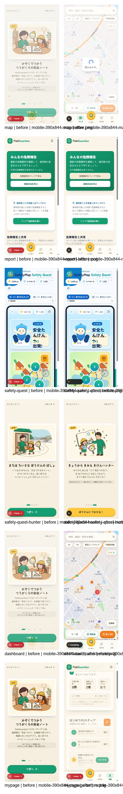
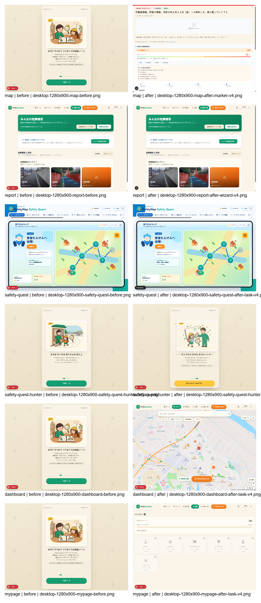

# PathGuardian UX監査レポート（2026-07-10）

## 監査範囲

- 対象: `http://localhost:3001`（ポート3000は別リポジトリのNext.jsが使用中だったため、対象リポジトリを同じ `pnpm dev` で3001に起動）
- ブラウザー: `browser-use` のローカルChromiumセッション
- 画面幅: モバイル 390×844、デスクトップ 1280×900
- 待機: 遷移後6秒以上、地図は10〜15秒。ログインは完了URLまで最大90秒監視
- ペルソナ: 漢字・長文・小タップ領域に弱い小学生、安全情報を短時間で確認したい保護者
- 認証: `demo@example.com` と `admin@test.com` の既知テストユーザー
- 変更: 製品コード・コミット・push・デプロイなし。追加物は本レポートと監査画像のみ
- 送信: 危険報告はタイトル欄に `[UXテスト]` を入力したが、3ステップウィザードが開かなかったためDB投稿は発生していない

## 総合判定

主要体験の見た目は「たんけんノート」の温かい世界観にまとまっており、LP、通常ナビゲーション、きけんハンターの子ども向け表現には強みがある。一方、初見ユーザーが目的を完了できるかという基準では、管理画面、ダッシュボード、危険報告、モバイル通学路クイズに完遂不能があった。さらに、地図の長い読み込みと長時間操作中の開発サーバー停止が、保護者の「素早く安全情報を見たい」という目的を損ねる。

## 確認できた強み

- LPの主CTA「無料ではじめる」はモバイル56px高で、登録画面へ正しく遷移する。
- モバイルの主要ボトムナビは72px高で、子どもでも押しやすい。
- デモログイン導線があり、初回体験を始めやすい。
- `routes` の「ルート追加」は、正しく押すと同一画面内で作成フォームを開き、状態変化が分かる。
- きけんハンターの主CTAは350×58pxで、ひらがな中心のコピーとイラストが子ども向けに適合している。
- Safe Magazineはカテゴリチップと大きな記事カードで一覧のスキャン性がよい。
- MyPageの空状態には「はじめての3ステップ」があり、単なる0件表示より次の行動が分かりやすい。

## 重大度つき指摘

### Critical

- [重大度 Critical] `/admin/dashboard` `/admin/reports` `/admin/costs` | admin@test.comで管理画面を開く | 3ルートともモバイル／デスクトップで `/map` へ戻され、管理UIへ到達できない | 管理者が審査・コスト確認を一切完遂できない | [mobile dashboard](ux-audit-2026-07-10/screenshots/mobile-390x844-admin-dashboard-after-navigation-v4.png), [desktop costs](ux-audit-2026-07-10/screenshots/desktop-1280x900-admin-costs-after-navigation-v4.png)
- [重大度 Critical] `/dashboard` | ログイン後にポイント・報告履歴を確認する | オンボーディングを閉じた後、`/dashboard` は `/map` へ遷移し、ダッシュボード固有情報を確認できない | 保護者も子どもも「自分の状況」を一画面で把握できない | [before](ux-audit-2026-07-10/screenshots/mobile-390x844-dashboard-before.png), [after](ux-audit-2026-07-10/screenshots/mobile-390x844-dashboard-after-task-v2.png)
- [重大度 Critical] `/report` → `/map` | 危険箇所を3ステップで報告する | `/report` は報告一覧で、入力ウィザードへの主CTAがない。`/map` の「危険箇所を報告する」を押しても長い地図読み込み状態のままでウィザードが開かず、入力・確認・送信へ進めない | 保護者の主要タスクである危険報告が完遂不能 | [report list](ux-audit-2026-07-10/screenshots/mobile-390x844-report-before.png), [wizard attempt](ux-audit-2026-07-10/screenshots/mobile-390x844-report-wizard-step0-open-v5.png)
- [重大度 Critical] `/route-quiz` | 地図でスタート／ゴールを選びクイズを開始する | 390px幅では地図が約55px幅の縦帯に潰れ、2点目を選べず「クイズ開始」が無効のまま。実クリック後もゴール未設定 | モバイル中心の子どもがクイズを開始できない | [before](ux-audit-2026-07-10/screenshots/mobile-390x844-route-quiz-before.png), [after clicks](ux-audit-2026-07-10/screenshots/mobile-390x844-route-quiz-focused-after-start-v5.png)

### High

- [重大度 High] `/login` → `/map` | ログイン後に危険地図を見る | 認証完了後10〜15秒待っても中央に「読み込み中…」だけが残る場面が複数回あり、フィルターやマーカー操作の成否が分からない | 急いで安全情報を見たい保護者が離脱、または連打する | [mobile](ux-audit-2026-07-10/screenshots/mobile-390x844-map-after-filter-v2.png), [desktop](ux-audit-2026-07-10/screenshots/desktop-1280x900-login-after-task-verified-v4.png)
- [重大度 High] 全体 | 全ルートを連続利用する | 長時間の通し操作中に開発サーバーがメモリ閾値で再起動後 `ECONNRESET` で終了し、ブラウザーは `ERR_CONNECTION_REFUSED` になった | セッション途中の作業が失われ、ゲーム・記事閲覧が中断する。開発環境固有の可能性はあるが再現2回 | [connection refused](ux-audit-2026-07-10/screenshots/mobile-390x844-hazard-focused-uploader-open-v5.png)
- [重大度 High] `/safety-quest/hunter` | 写真を選んで危険を見つける | オンボーディングをスキップして写真を選ぶと、主画像領域が黒くなり「Rendering…」のまま。次の操作や復旧方法が見えない | 子どもが壊れたと判断し、最重要体験から離脱する | [before photo](ux-audit-2026-07-10/screenshots/mobile-390x844-hunter-focused-main-before-photo-v5.png), [after photo](ux-audit-2026-07-10/screenshots/mobile-390x844-hunter-focused-photo-selected-v5.png)
- [重大度 High] `/register` | 既存メールで登録を試す | 登録ボタン押下後も画面がほぼ変わらず、重複メール・成功・処理中の明確なメッセージが見えない | 初見ユーザーが登録できたか判断できず再送・離脱する | [before](ux-audit-2026-07-10/screenshots/mobile-390x844-register-before.png), [after](ux-audit-2026-07-10/screenshots/mobile-390x844-register-after-task.png)
- [重大度 High] `/forgot-password` | 不正形式メールで再設定を送る | `ux-test-invalid` を入力し送信しても、フィールドの緑フォーカス以外に理解できるエラー説明が見えない | 修正方法が分からず復旧できない | [after](ux-audit-2026-07-10/screenshots/mobile-390x844-forgot-password-after-task.png)
- [重大度 High] 初回ログイン後の深いルート | 地図・通学路・MyPageへ直接進む | 4ページの全画面オンボーディングがタスク画面を覆う。小さな「スキップ」を見つけるか4回進むまで、本来の目的に触れない | 目的が明確な保護者ほど遠回りに感じ、子どもは次の行動を見失う | [map blocked](ux-audit-2026-07-10/screenshots/mobile-390x844-map-before.png), [routes blocked](ux-audit-2026-07-10/screenshots/mobile-390x844-routes-before.png)
- [重大度 High] `/report` | 危険を新規報告する | 画面の最上位CTAが「危険箇所をマップで見る」「投稿方法を学ぶ」で、新規報告の動詞がない。「危険報告」は一覧タブ名として使われる | 報告したいユーザーが閲覧画面で行き止まる | [mobile report](ux-audit-2026-07-10/screenshots/mobile-390x844-report-before.png)

### Medium

- [重大度 Medium] `/map` | マーカー詳細を開く | マーカー選択後、地図上の軽量カードではなく密度の高い報告詳細が画面全体を占有する | 周辺の他マーカーと比較したい保護者が地図文脈を失う | [desktop marker detail](ux-audit-2026-07-10/screenshots/desktop-1280x900-map-after-marker-v4.png)
- [重大度 Medium] `/routes` | 通学路を追加する | 「ルート追加」でフォームは開くが、入力方法が3種類、開始／終了地点、検索、地図、名称入力と長く、初手が分散する | ITリテラシー普通の保護者が設定途中で迷う | [mobile add form](ux-audit-2026-07-10/screenshots/mobile-390x844-routes-focused-add-open-v5.png)
- [重大度 Medium] `/school-route-news` | 一覧から記事詳細を開く | 最初の記事カード操作後、モバイルでは記事ではなく「きけんハンター／不審者アラート」の販促モーダルが前面に出た | 安全ニュースを急いで読む目的が中断される | [after click](ux-audit-2026-07-10/screenshots/mobile-390x844-school-route-news-after-task-v2.png)
- [重大度 Medium] `/safe-magazine` | 一覧から詳細へ回遊する | モバイルでは詳細が表示された一方、デスクトップでは同じカード操作後も一覧表示のままで、遷移フィードバックが一貫しない | デバイスによって操作結果の予測ができない | [mobile](ux-audit-2026-07-10/screenshots/mobile-390x844-safe-magazine-after-task-v2.png), [desktop](ux-audit-2026-07-10/screenshots/desktop-1280x900-safe-magazine-after-task-v4.png)
- [重大度 Medium] `/leaderboard` | 自分の順位を確認する | 0件時は「まだランキングデータがありません」のみで、ポイント獲得方法やミッションへの導線がない | 子どもが次に何をすればランキングに載るか分からない | [mobile](ux-audit-2026-07-10/screenshots/mobile-390x844-leaderboard-before.png)
- [重大度 Medium] `/missions` `/badges` | 達成条件と次の行動を理解する | 進捗0のカードが縦に並び、バッジは灰色でロック理由と最短アクションが弱い | ゲーミフィケーションが動機づけより「未達一覧」に見える | [missions](ux-audit-2026-07-10/screenshots/mobile-390x844-missions-before.png), [badges](ux-audit-2026-07-10/screenshots/mobile-390x844-badges-before.png)
- [重大度 Medium] `/safety-quest` `/hazard-game` | ゲーム群を横断する | 青いゲームUI、紫グラデーション、たんけんノートのクリーム／緑／黄が混在し、同一製品内の階層が視覚的に分断される | 子どもが別機能・別サービスと感じ、戻り先を迷う | [quest](ux-audit-2026-07-10/screenshots/mobile-390x844-safety-quest-before.png), [hazard game](ux-audit-2026-07-10/screenshots/mobile-390x844-hazard-game-before.png)
- [重大度 Medium] `/safety-quest/hunter` | オンボーディングを進める | ページ位置ドットが9×9px、1ページ目だけ26×9pxで44px基準を大きく下回る | 小学生がページを直接選びにくく、誤タップしやすい | [step 4](ux-audit-2026-07-10/screenshots/mobile-390x844-safety-quest-hunter-after-task-v2.png)
- [重大度 Medium] `/route-quiz` | 地点設定の意味を理解する | 「スタート／ゴール」「指定」「未設定」など漢字中心で、地図をどこから何回押すかの短い視覚説明がない | 漢字が読めない子どもは開始条件を理解できない | [mobile quiz](ux-audit-2026-07-10/screenshots/mobile-390x844-route-quiz-before.png)
- [重大度 Medium] `/school-route-news` `/safe-magazine` | 子どもが記事を読む | タイトル・要約が漢字と長文中心で、読み上げ・やさしい表示・ふりがな相当の切替がない | 子どもペルソナは内容に入る前に離脱する | [news](ux-audit-2026-07-10/screenshots/mobile-390x844-school-route-news-before.png), [magazine](ux-audit-2026-07-10/screenshots/mobile-390x844-safe-magazine-before.png)
- [重大度 Medium] `/contact` | 問い合わせる | 問い合わせフォームではなくメール／GitHub案内の静的文章のみで、完了までの所要時間や受付状態がない | 保護者が「どこへ何を書けばよいか」を自分で組み立てる必要がある | [contact](ux-audit-2026-07-10/screenshots/mobile-390x844-contact-before.png)

### Low

- [重大度 Low] `/lp` | モバイルで機能説明を読む | 長い縦スクロールで問題提起・機能・FAQが連続し、途中の現在位置や要約ナビがない | 読み飛ばす保護者が主要価値に到達しにくい | [LP](ux-audit-2026-07-10/screenshots/mobile-390x844-lp-before.png)
- [重大度 Low] `/privacy` `/terms` | 規約の要点を確認する | 長文カードのみで要約、目次、子ども向け説明がない | 同意前に重要点を拾いにくい | [privacy](ux-audit-2026-07-10/screenshots/mobile-390x844-privacy-before.png), [terms](ux-audit-2026-07-10/screenshots/mobile-390x844-terms-before.png)
- [重大度 Low] `/register` | 必須条件を確認する | 必須マークがなく、パスワード条件は薄い補助文のみ | 入力後に条件不足を知る可能性がある | [register](ux-audit-2026-07-10/screenshots/mobile-390x844-register-before.png)

## 重大度×修正コスト：改善優先順位トップ10

| 優先 | 問題 | 重大度 | 修正コスト | 推奨する最初の修正 |
|---:|---|---|---|---|
| 1 | admin 3ルートが `/map` へ戻る | Critical | M | adminロール判定とリダイレクト条件を修正し、権限不足時は理由を表示 |
| 2 | `/dashboard` が `/map` へ戻る | Critical | S | ダッシュボードを表示するか、正式廃止なら全導線とURLを統合 |
| 3 | 危険報告ウィザードへ到達できない | Critical | M | `/report` 最上部に「危険を報告する」主CTAを置き、地図未読込でもウィザードを開く |
| 4 | モバイル通学路クイズで地図が55px幅 | Critical | M | モバイルを上下分割にし、地図を画面高の50〜60%確保 |
| 5 | 地図の長い無反応・読み込み | High | M | 段階的スケルトン、読込状況、再試行、地図以外の操作を先に有効化 |
| 6 | ハンター写真選択後が黒画面 | High | M | プレビュー、処理段階、タイムアウト、やり直しCTAを常時表示 |
| 7 | 登録・再設定フォームのエラーが不明 | High | S | フィールド直下の具体的エラーと送信中／成功トーストを追加 |
| 8 | 初回オンボーディングが深いリンクを遮る | High | S | 1画面要約＋後で見る。目的画面を先に見せる |
| 9 | ニュース閲覧を販促モーダルが遮る | Medium | S | 記事操作中は販促を出さず、任意の固定導線へ移動 |
| 10 | ランキング・ミッション・バッジの空状態に次の行動がない | Medium | S | 「最初の10ptを取る」1アクションを表示 |

## タスク別の健康状態

1. LP→登録→ログイン: **要改善**。主導線は通るが、登録結果のフィードバックが弱く、初回コンパイル待ちが長い。
2. 危険地図: **要改善**。フィルターとマーカーは操作できたが、読み込み待ちが長く、詳細で地図文脈を失う。
3. 危険報告: **不健全**。一覧は見られるが3ステップ入力へ到達できない。
4. きけんハンター: **不健全**。オンボーディングと主画面は良いが写真選択後に黒い処理状態となる。
5. Dashboard／MyPage: **一部不健全**。MyPageは使えるがDashboardはMapへ戻る。
6. 通学路／クイズ: **一部不健全**。ルート追加フォームは開くが、モバイルクイズは開始不能。
7. ニュース／マガジン: **要改善**。一覧は読みやすいが詳細回遊がデバイス間で不安定。
8. ミッション／バッジ／ランキング／ゲーム: **要改善**。表示はできるが0件・0ptからの次アクションが弱い。
9. 静的・補助ページ: **概ね健全**。規約・問い合わせは読めるが長文と復旧案内に改善余地。
10. 管理画面: **不健全**。3ルートすべて到達不能。

## スクリーンショット証拠一覧

各コンタクトシートは、左が操作前、右が操作後。個別画像は同フォルダー内に保持している。

- [モバイル：登録・ログイン・補助](ux-audit-2026-07-10/screenshots/contact-acquisition-mobile-390x844.png)
- [モバイル：地図・報告・ハンター・MyPage](ux-audit-2026-07-10/screenshots/contact-core-mobile-390x844.png)
- [モバイル：通学路・クイズ・記事](ux-audit-2026-07-10/screenshots/contact-routes-content-mobile-390x844.png)
- [モバイル：ゲーミフィケーション](ux-audit-2026-07-10/screenshots/contact-gamification-mobile-390x844.png)
- [モバイル：規約・管理](ux-audit-2026-07-10/screenshots/contact-static-admin-mobile-390x844.png)
- [デスクトップ：登録・ログイン・補助](ux-audit-2026-07-10/screenshots/contact-acquisition-desktop-1280x900.png)
- [デスクトップ：地図・報告・ハンター・MyPage](ux-audit-2026-07-10/screenshots/contact-core-desktop-1280x900.png)
- [デスクトップ：通学路・クイズ・記事](ux-audit-2026-07-10/screenshots/contact-routes-content-desktop-1280x900.png)
- [デスクトップ：ゲーミフィケーション](ux-audit-2026-07-10/screenshots/contact-gamification-desktop-1280x900.png)
- [デスクトップ：規約・管理](ux-audit-2026-07-10/screenshots/contact-static-admin-desktop-1280x900.png)

## 証拠の限界

- スクリーンショットとDOM上の可視要素・実クリック・入力で監査した。スクリーンリーダー読み上げ順、全キーボード操作、200%ズーム、OSの高コントラスト設定は未検証。
- コントラストは見た目上のリスクのみを記載し、WCAG適合を断定していない。
- 長時間操作中の停止はローカル開発サーバーで再現した。Node.js 24で起動しており、リポジトリ指定のNode.js 20と異なるため、本番同等の性能障害とは断定しない。
- `/report` の最終DB送信、AI写真解析の完了、カメラ実機許可拒否後の復旧は、入口／レンダリング段階で止まったため完了確認できていない。
