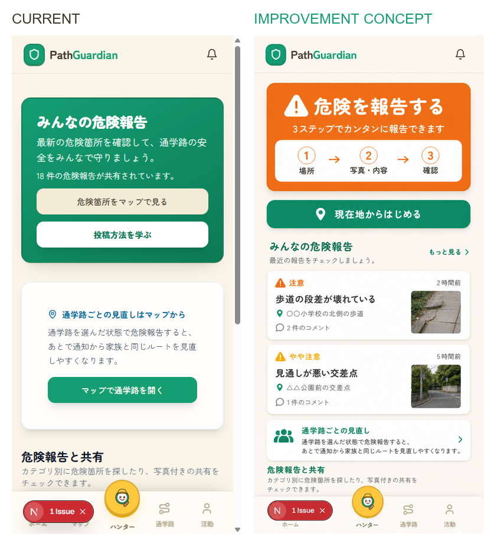
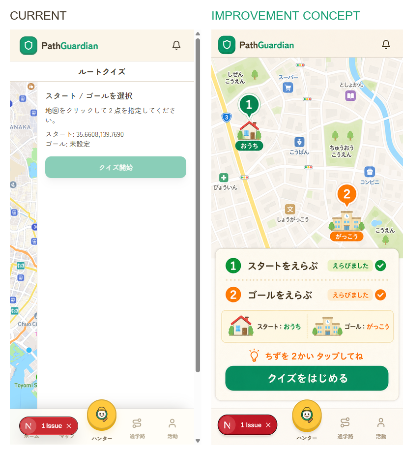
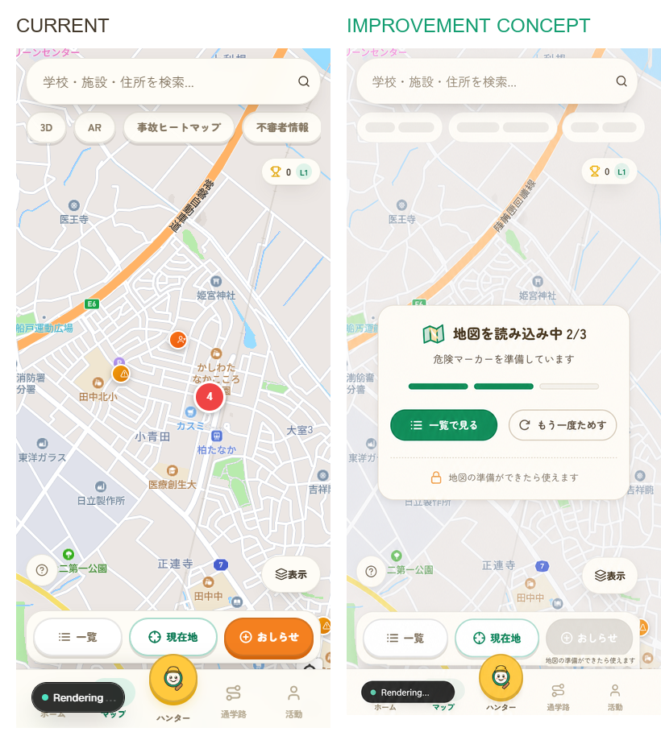
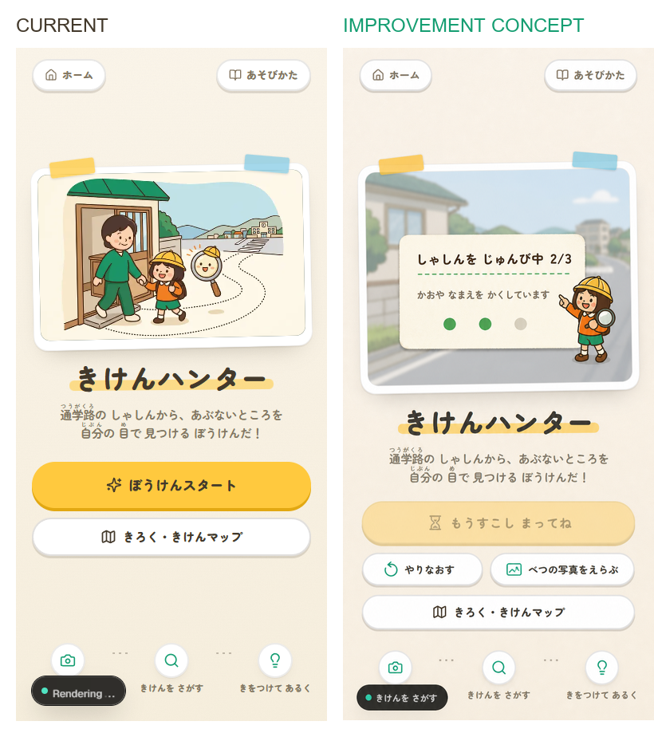
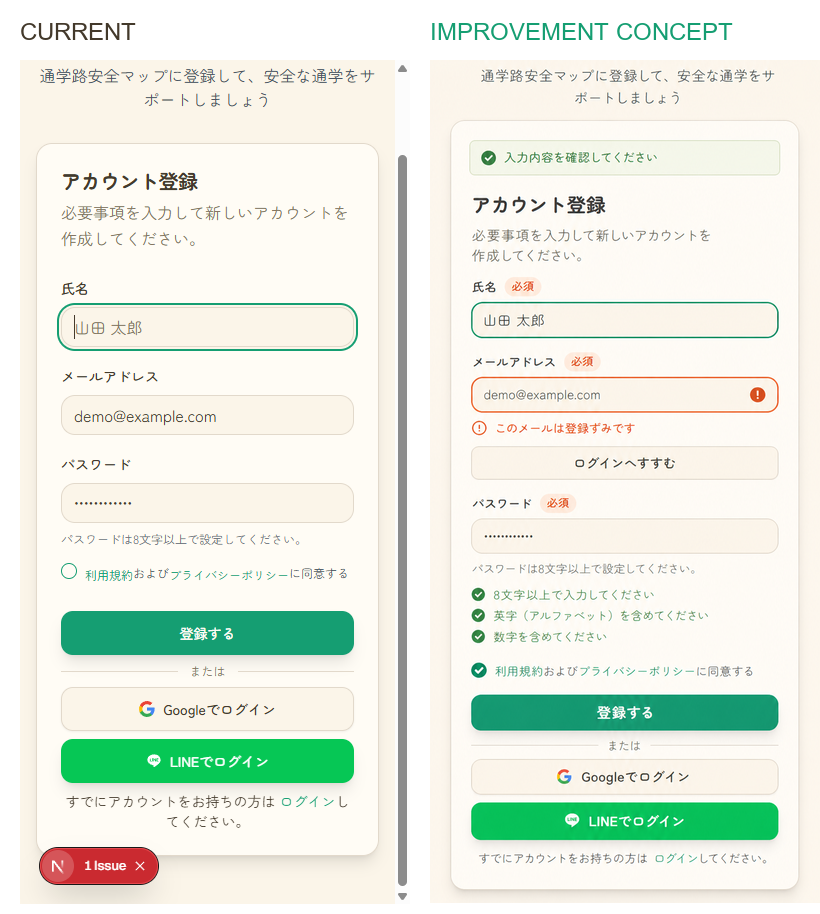
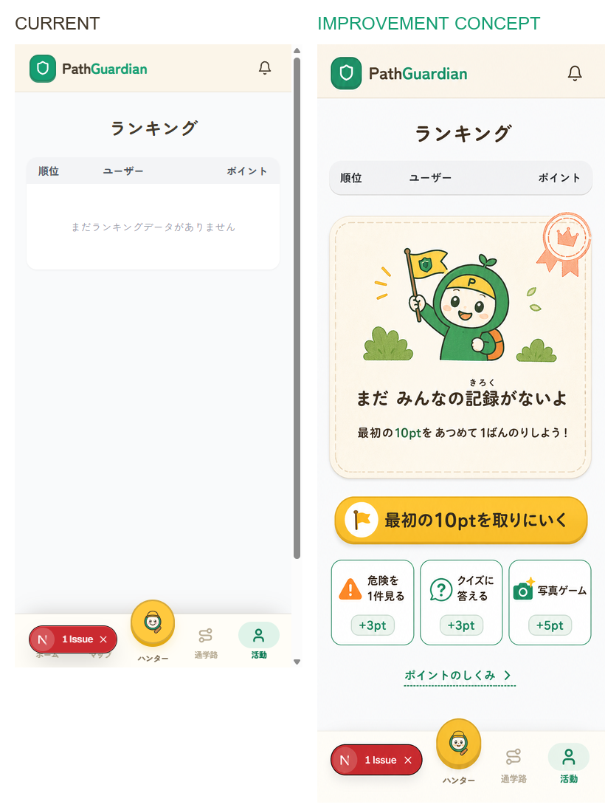

# 優先画面の改善案（現状 vs 改善イメージ）

生成方式: built-in `image_gen`。現状スクリーンショットを編集対象として使用し、`lib/design/tanken.ts` の「たんけんノート」言語を維持したモバイル基準のコンセプト。

> これは実装前の方向性確認用モック。文言・情報構造・状態表現を評価するもので、実装コードは変更していない。

## 1. 危険報告の入口

- 最上位に「危険を報告する」を置き、閲覧と投稿の動詞を分離。
- 「場所 → 写真・内容 → 確認」を先に見せ、所要ステップを予測可能にする。
- 「現在地からはじめる」を独立させ、保護者の最短経路を作る。

現状: [mobile-390x844-report-before.png](../ux-audit-2026-07-10/screenshots/mobile-390x844-report-before.png)  
改善案: [01-report-primary-cta.png](mockups/01-report-primary-cta.png)

## 2. モバイル通学路クイズ

- 地図を画面上部の約52%まで広げ、2地点を押せる面積を確保。
- ①スタート、②ゴールの状態を色とチェックで明示。
- 漢字中心の説明を「ちずを 2かい タップしてね」に置き換える。

現状: [mobile-390x844-route-quiz-focused-after-start-v5.png](../ux-audit-2026-07-10/screenshots/mobile-390x844-route-quiz-focused-after-start-v5.png)  
改善案: [02-route-quiz-mobile-layout.png](mockups/02-route-quiz-mobile-layout.png)

## 3. 地図の段階的ローディング

- スピナーだけでなく「2/3 危険マーカー準備中」と進行段階を表示。
- 地図が遅くても「一覧で見る」で安全情報へ到達できるようにする。
- 報告CTAは消さず、無効理由と再試行を同じ面に置く。

現状: [mobile-390x844-map-after-filter-v2.png](../ux-audit-2026-07-10/screenshots/mobile-390x844-map-after-filter-v2.png)  
改善案: [03-map-progressive-loading.png](mockups/03-map-progressive-loading.png)

## 4. きけんハンターの写真処理中

- 黒画面をやめ、ぼかした写真と「2/3」を表示して処理の意味を伝える。
- 子ども向けに「かおや なまえを かくしています」と説明。
- 「やりなおす」「べつの写真をえらぶ」を常時残し、行き止まりをなくす。

現状: [mobile-390x844-hunter-focused-photo-selected-v5.png](../ux-audit-2026-07-10/screenshots/mobile-390x844-hunter-focused-photo-selected-v5.png)  
改善案: [04-hunter-photo-processing.png](mockups/04-hunter-photo-processing.png)

## 5. 登録フォームのエラー復旧

- 重複メールをフィールド直下で具体的に説明。
- 既存ユーザー向け「ログインへすすむ」をエラーの直後に置く。
- 必須チップとパスワード条件チェックで、送信前に不足を把握できるようにする。

現状: [mobile-390x844-register-after-task.png](../ux-audit-2026-07-10/screenshots/mobile-390x844-register-after-task.png)  
改善案: [05-register-inline-errors.png](mockups/05-register-inline-errors.png)

## 6. ランキングの空状態

- 0件を失敗ではなく「1ばんのり」の機会として説明。
- 最初の10ptへ直接進む大きなCTAを置く。
- 3つの短い獲得方法を見せ、次の行動を選べるようにする。

現状: [mobile-390x844-leaderboard-before.png](../ux-audit-2026-07-10/screenshots/mobile-390x844-leaderboard-before.png)  
改善案: [06-leaderboard-empty-action.png](mockups/06-leaderboard-empty-action.png)

## 採用判断で確認したい点

- 危険報告は、オレンジ主CTAと緑の「現在地」CTAの優先順位でよいか。
- クイズは「地図52%＋下部カード」の上下分割でよいか。
- ハンター処理中に、ぼかした写真を残す方針でプライバシー上問題ないか。

